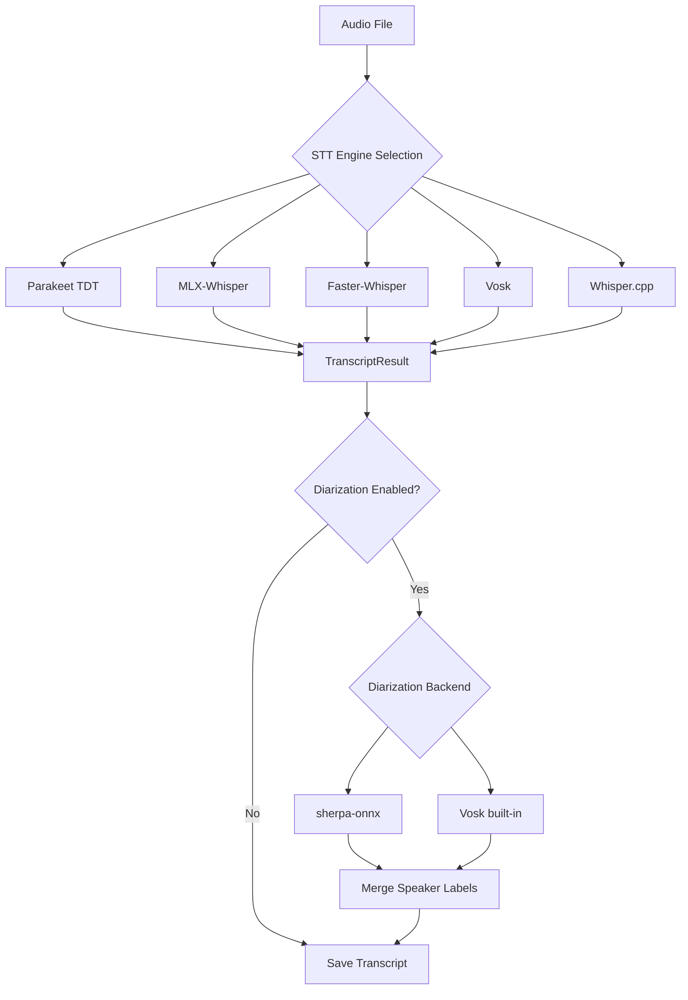
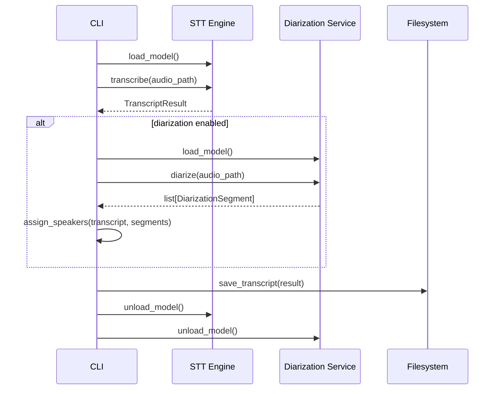

# Parakeet ASR + sherpa-onnx Speaker Diarization

| Field   | Value |
|---------|-------|
| Version | 1.0 |
| Date    | 2026-03-19 |
| Status  | Implemented |

## Summary

Add NVIDIA Parakeet TDT 0.6B v3 as a new STT engine and sherpa-onnx as a new speaker diarization backend. Parakeet delivers **16x faster** transcription than MLX-Whisper with comparable accuracy and native word-level timestamps. sherpa-onnx diarization uses pyannote-3.0 segmentation with speaker embeddings, replacing the current Vosk-only diarization with a more accurate, engine-agnostic solution.

## Problem Statement

### Current State

meetcap supports four STT engines (Faster-Whisper, MLX-Whisper, Vosk, Whisper.cpp) and diarization only via Vosk. Key limitations:

1. **Speed**: MLX-Whisper large-v3-turbo processes 40s audio in ~20s (2x realtime). For long meetings this adds significant wait time.
2. **Diarization coupling**: Speaker diarization is only available when using Vosk as the STT engine, forcing a trade-off between transcription quality and speaker identification.
3. **Diarization quality**: Vosk's AgglomerativeClustering approach requires sklearn, uses hand-tuned heuristics for speaker count estimation, and has no configurable threshold.

### Goals

1. Add Parakeet TDT 0.6B v3 as a new STT engine, achieving 30x+ realtime transcription speed with high accuracy
2. Decouple diarization from the STT engine so any engine can produce speaker-attributed transcripts
3. Add sherpa-onnx as a standalone diarization backend that works with any STT engine
4. Maintain backward compatibility with all existing engines and workflows

### Non-Goals

1. Removing any existing STT engine
2. Real-time/streaming transcription (Parakeet supports it, but that's a separate feature)
3. Multi-language diarization optimization
4. Training or fine-tuning any models

## Research Findings

### Parakeet TDT Architecture

Parakeet TDT (Token-and-Duration Transducer) is fundamentally different from Whisper. While Whisper is an encoder-decoder transformer, TDT extends the RNN-Transducer with a dual-head joint network that predicts both **tokens** and **durations** simultaneously. This allows it to skip silent frames in batches rather than stepping through every frame, yielding up to 2.8x faster inference than standard RNN-T.

Key specs:
- **Parameters**: 600M (FastConformer encoder + TDT decoder)
- **Vocabulary**: 8,192 SentencePiece tokens, 25 languages
- **Output**: Word-level timestamps, sentence boundaries, per-token confidence scores
- **Input**: Any audio format via librosa (resampled to 16kHz internally)

### Benchmarks (Apple Silicon M-series, measured on this machine)

| Metric | Parakeet TDT 0.6B | MLX-Whisper large-v3-turbo | Factor |
|--------|-------------------|---------------------------|--------|
| 40s meeting audio | 1.22s | 19.68s | **16.1x faster** |
| 34s clear speech | 0.80s | 5.23s | **6.5x faster** |
| Realtime factor (40s) | 32.7x | 2.0x | — |
| Realtime factor (34s) | 42.5x | 6.5x | — |
| Model load (cached) | 0.84s | ~1s | comparable |
| Model size | 2.51 GB | ~3.1 GB | 19% smaller |
| Avg confidence (clear speech) | 0.996 | N/A | — |
| Avg confidence (meeting audio) | 0.953 | N/A | — |
| Word timestamps | native | opt-in | — |
| Sentence segmentation | native | manual | — |

**Quality comparison** on Harvard sentences (ground truth available):

| Ground Truth | Parakeet | MLX-Whisper |
|---|---|---|
| "The birch canoe slid on the smooth planks." | "The birch canoe slid on the smooth planks." | "The birch canoe slid on the smooth planks." |
| "The box was thrown beside the parked truck." | "The box was thrown beside the park truck." | "The box was thrown beside the parked truck." |

Both models produce near-identical quality. Parakeet occasionally drops final consonants on some words but has higher overall confidence and better timestamp precision.

**Published WER benchmarks** (Parakeet TDT 0.6B v3, HuggingFace Open ASR Leaderboard):
- Average: 6.34% WER
- **AMI (Meetings): 11.31% WER** — directly relevant to meetcap's use case
- LibriSpeech test-clean: 1.93% WER
- Noise-robust: 6.34% clean → 8.23% at SNR 5 → 11.66% at SNR 0

**Long audio handling**: parakeet-mlx has built-in chunking (`chunk_duration=120`, `overlap_duration=15` defaults) for audio exceeding the model's context window. For very long meetings, local attention mode (`set_attention_model("rel_pos_local_attn", (256, 256))`) enables processing up to 3 hours with reduced memory.

### sherpa-onnx Diarization

sherpa-onnx (k2-fsa) provides offline speaker diarization through a 3-stage pipeline:

```
Audio → Segmentation (pyannote-3.0) → Embedding Extraction → Clustering → Speaker Labels
```

**Benchmarks (this machine)**:

| Configuration | 57s/4-speaker (zh) | 40s meeting (en) | Speed |
|---|---|---|---|
| pyannote-3.0 + 3dspeaker | 5 detected, 10.5s | 3 detected, 9.9s | 4x RT |
| pyannote-3.0 + NeMo-en | — | 2 detected, 2.7s | 15x RT |
| reverb-v1 + 3dspeaker | 5 detected, 16.0s | 1 detected, 13.5s | 3x RT |

**Threshold tuning** (pyannote-3.0 + 3dspeaker, 4-speaker test file):

| Threshold | Speakers Detected (expected=4) |
|---|---|
| 0.5 | 7 |
| 0.7 | 5 |
| 0.8 | 5 |
| 0.85 | 5 |
| 0.9 | 4 |

**Recommended defaults**:
- Segmentation: pyannote-3.0 (faster, better multi-speaker detection)
- Embedding: 3dspeaker eres2net (better separation; NeMo is faster but more conservative)
- Threshold: 0.85 (good balance; configurable)
- Model sizes: segmentation ~5MB, embedding ~38MB (total ~43MB)

**Known limitation**: sherpa-onnx issue [#1708](https://github.com/k2-fsa/sherpa-onnx/issues/1708) reports that ONNX-converted speaker embeddings can diverge from PyTorch originals (cosine distance ~0.82 between implementations). This may affect clustering accuracy vs. native pyannote. However, our experiments showed reasonable speaker separation in practice (3 speakers detected on multi-speaker meeting audio, correctly grouping contiguous speech). The configurable threshold mitigates this — users can tune for their audio characteristics. sherpa-onnx runs on CPU only (no Metal acceleration on macOS), which makes diarization the pipeline bottleneck (~4x realtime vs Parakeet's 32x).

### Combined Pipeline Performance

| Stage | Time (40s audio) | Realtime Factor |
|---|---|---|
| Parakeet ASR | 1.22s | 32.7x |
| sherpa-onnx diarization | 9.89s | 4.0x |
| **Total pipeline** | **11.12s** | **3.6x** |

Diarization is the bottleneck. For meetings where diarization is not needed, Parakeet alone is 32x realtime.

## Design Overview

### Approach: New Engine + Decoupled Diarization Service



**Key architectural decisions**:

1. **Parakeet as a first-class engine**: Same `TranscriptionService` interface as other engines. Selected via `--stt parakeet` or config `stt_engine = "parakeet"`.

2. **Diarization as a separate service**: New `DiarizationService` abstraction that runs *after* STT, not inside it. This decouples speaker identification from transcription engine choice.

3. **Backward-compatible Vosk diarization**: The existing Vosk diarization path remains functional. When `stt_engine = "vosk"` and `enable_speaker_diarization = true`, Vosk performs diarization internally during transcription (speaker embeddings + clustering). The new sherpa-onnx diarization runs *only* when `diarization_backend = "sherpa"` and the STT engine is *not* Vosk. This prevents double-diarization. The `--diarize` CLI flag sets `diarization_backend = "sherpa"` by default; Vosk users must explicitly set `--diarization-backend vosk` to use the legacy path.

4. **Speaker assignment via time overlap**: Diarization produces speaker-labeled time segments. Each ASR sentence/segment is assigned to the speaker with maximum temporal overlap.

### Alternatives Rejected

| Alternative | Reason |
|---|---|
| Use NeMo directly (not parakeet-mlx) | NeMo is ~2GB+ of dependencies, requires PyTorch. parakeet-mlx is lightweight, MLX-native. |
| Use pyannote-audio directly for diarization | Requires PyTorch, 500MB+ dependencies, GPL-licensed speaker embedding model. sherpa-onnx is Apache 2.0 and uses ONNX Runtime (~21MB). |
| ~~Make Parakeet the default engine~~ | ~~Too aggressive for v1.~~ **Decision reversed**: Parakeet is now the default with diarization enabled. |
| Run diarization and ASR in parallel | Both need audio loaded; diarization needs the full audio. Sequential is simpler and still fast enough (3.6x RT). |

## Detailed Design

### New Class: `ParakeetService`

```python
# meetcap/services/transcription.py

class ParakeetService(TranscriptionService):
    """transcription using Parakeet TDT via parakeet-mlx (Apple Silicon optimized)"""

    def __init__(
        self,
        model_name: str = "mlx-community/parakeet-tdt-0.6b-v3",
        language: str | None = None,
    ):
        self.model_name = model_name
        self.language = language
        self.model = None

    def _load_model(self) -> None:
        if self.model is not None:
            return
        try:
            from parakeet_mlx import from_pretrained
        except ImportError as e:
            raise ImportError(
                "parakeet-mlx not installed. install with: pip install parakeet-mlx"
            ) from e

        console.print(f"[cyan]loading parakeet model '{self.model_name}'...[/cyan]")
        self.model = from_pretrained(self.model_name)
        console.print("[green]✓[/green] parakeet model ready")

    def transcribe(self, audio_path: Path) -> TranscriptResult:
        if not audio_path.exists():
            raise FileNotFoundError(f"audio file not found: {audio_path}")

        self._load_model()

        console.print(f"[cyan]transcribing {audio_path.name} with parakeet...[/cyan]")
        start_time = time.time()

        with Progress(
            SpinnerColumn(),
            TextColumn("[progress.description]{task.description}"),
            console=console,
            transient=True,
        ) as progress:
            task = progress.add_task("transcribing audio...", total=None)

            try:
                result = self.model.transcribe(str(audio_path))
                progress.update(task, description="processing segments...")

                segments = []
                for i, sentence in enumerate(result.sentences):
                    segments.append(TranscriptSegment(
                        id=i,
                        start=sentence.start,
                        end=sentence.end,
                        text=sentence.text,
                        confidence=sentence.confidence,
                    ))

                detected_language = self.language or "en"

            except Exception as e:
                console.print(f"[red]parakeet transcription failed: {e}[/red]")
                console.print("[yellow]falling back to mlx-whisper...[/yellow]")
                try:
                    fallback = MlxWhisperService(auto_download=True)
                    return fallback.transcribe(audio_path)
                except Exception as fallback_error:
                    raise RuntimeError(
                        f"both parakeet and mlx-whisper failed. "
                        f"parakeet error: {e}, fallback error: {fallback_error}"
                    ) from e

        duration = time.time() - start_time
        audio_duration = segments[-1].end if segments else 0.0

        if audio_duration > 0:
            console.print(
                f"[green]✓[/green] parakeet transcription complete: "
                f"{len(segments)} segments in {duration:.1f}s "
                f"(speed: {audio_duration / duration:.1f}x)"
            )

        return TranscriptResult(
            audio_path=str(audio_path),
            sample_rate=16000,
            language=detected_language,
            segments=segments,
            duration=audio_duration,
            stt={"engine": "parakeet", "model_name": self.model_name},
        )

    def unload_model(self) -> None:
        if self.model is not None:
            del self.model
            self.model = None
            try:
                import mlx.core as mx
                mx.metal.clear_cache()
            except (ImportError, AttributeError):
                pass
            import gc
            gc.collect()
            console.print("[dim]parakeet model unloaded[/dim]")
```

**Parakeet output mapping**:

| Parakeet `AlignedSentence` | meetcap `TranscriptSegment` |
|---|---|
| `.text` | `.text` |
| `.start` | `.start` |
| `.end` | `.end` |
| `.confidence` | `.confidence` |
| N/A | `.speaker_id` (set by diarization) |

### New Class: `SherpaOnnxDiarizationService`

```python
# meetcap/services/diarization.py (new file)

class DiarizationService:
    """base class for speaker diarization services"""

    def diarize(self, audio_path: Path) -> list[DiarizationSegment]:
        """identify speakers in audio, return time-labeled segments"""
        raise NotImplementedError

    def load_model(self) -> None:
        raise NotImplementedError

    def unload_model(self) -> None:
        raise NotImplementedError


@dataclass
class DiarizationSegment:
    """a time segment with speaker identity"""
    start: float
    end: float
    speaker: int  # 0-indexed speaker ID


class SherpaOnnxDiarizationService(DiarizationService):
    """speaker diarization using sherpa-onnx"""

    def __init__(
        self,
        segmentation_model: str,  # path to pyannote ONNX model
        embedding_model: str,     # path to speaker embedding ONNX model
        num_speakers: int = -1,   # -1 for auto-detect
        threshold: float = 0.85,
        min_duration_on: float = 0.3,
        min_duration_off: float = 0.5,
    ):
        self.segmentation_model = segmentation_model
        self.embedding_model = embedding_model
        self.num_speakers = num_speakers
        self.threshold = threshold
        self.min_duration_on = min_duration_on
        self.min_duration_off = min_duration_off
        self.sd = None

    def load_model(self) -> None:
        if self.sd is not None:
            return
        import sherpa_onnx

        config = sherpa_onnx.OfflineSpeakerDiarizationConfig(
            segmentation=sherpa_onnx.OfflineSpeakerSegmentationModelConfig(
                pyannote=sherpa_onnx.OfflineSpeakerSegmentationPyannoteModelConfig(
                    model=self.segmentation_model,
                ),
            ),
            embedding=sherpa_onnx.SpeakerEmbeddingExtractorConfig(
                model=self.embedding_model,
            ),
            clustering=sherpa_onnx.FastClusteringConfig(
                num_clusters=self.num_speakers,
                threshold=self.threshold,
            ),
            min_duration_on=self.min_duration_on,
            min_duration_off=self.min_duration_off,
        )
        if not config.validate():
            raise RuntimeError("sherpa-onnx diarization config validation failed")
        self.sd = sherpa_onnx.OfflineSpeakerDiarization(config)

    def diarize(self, audio_path: Path) -> list[DiarizationSegment]:
        """run diarization pipeline, return sorted speaker segments"""
        self.load_model()

        # load and resample audio to expected sample rate (16kHz mono)
        import soundfile as sf
        audio, sr = sf.read(str(audio_path), dtype="float32", always_2d=True)
        audio = audio[:, 0]  # mono
        if sr != self.sd.sample_rate:
            import librosa
            audio = librosa.resample(audio, orig_sr=sr, target_sr=self.sd.sample_rate)

        result = self.sd.process(audio).sort_by_start_time()

        return [
            DiarizationSegment(start=r.start, end=r.end, speaker=r.speaker)
            for r in result
        ]

    def unload_model(self) -> None:
        if self.sd is not None:
            del self.sd
            self.sd = None
            import gc
            gc.collect()
```

### Speaker Assignment Algorithm

After both ASR and diarization complete, merge results by maximum time overlap:

```python
def assign_speakers(
    transcript: TranscriptResult,
    diarization: list[DiarizationSegment],
) -> TranscriptResult:
    """assign speaker IDs to transcript segments based on time overlap"""
    for seg in transcript.segments:
        best_speaker = None
        best_overlap = 0.0
        for diar in diarization:
            overlap = max(0, min(seg.end, diar.end) - max(seg.start, diar.start))
            if overlap > best_overlap:
                best_overlap = overlap
                best_speaker = diar.speaker
        seg.speaker_id = best_speaker

    # remap non-sequential speaker IDs to 0-indexed (sherpa-onnx may return e.g. 0, 3, 4)
    raw_ids = sorted(set(s.speaker_id for s in transcript.segments if s.speaker_id is not None))
    id_map = {old: new for new, old in enumerate(raw_ids)}
    for seg in transcript.segments:
        if seg.speaker_id is not None:
            seg.speaker_id = id_map[seg.speaker_id]

    # build speaker metadata
    unique_speakers = sorted(set(s.speaker_id for s in transcript.segments if s.speaker_id is not None))
    transcript.speakers = [{"id": s, "label": f"Speaker {s + 1}"} for s in unique_speakers]
    transcript.diarization_enabled = True
    return transcript
```

### Configuration Changes

New entries in `~/.meetcap/config.toml`:

```toml
[models]
stt_engine = "faster-whisper"  # new option: "parakeet"
parakeet_model_name = "mlx-community/parakeet-tdt-0.6b-v3"

# diarization backend: "vosk" (legacy), "sherpa" (new), "none"
diarization_backend = "sherpa"
sherpa_segmentation_model = "~/.meetcap/models/sherpa-onnx-pyannote-segmentation-3-0/model.onnx"
sherpa_embedding_model = "~/.meetcap/models/3dspeaker_speech_eres2net_base_sv_zh-cn_3dspeaker_16k.onnx"
sherpa_num_speakers = -1       # -1 for auto-detect
sherpa_cluster_threshold = 0.85
```

New environment variables:

| Variable | Config Key | Default |
|---|---|---|
| `MEETCAP_PARAKEET_MODEL` | `models.parakeet_model_name` | `mlx-community/parakeet-tdt-0.6b-v3` |
| `MEETCAP_DIARIZATION_BACKEND` | `models.diarization_backend` | `sherpa` |
| `MEETCAP_SHERPA_NUM_SPEAKERS` | `models.sherpa_num_speakers` | `-1` |
| `MEETCAP_SHERPA_THRESHOLD` | `models.sherpa_cluster_threshold` | `0.85` |

**Config interaction with legacy Vosk diarization**:
- `enable_speaker_diarization = true` + `stt_engine = "vosk"` → Vosk internal diarization (legacy, unchanged)
- `enable_speaker_diarization = true` + `stt_engine != "vosk"` + `diarization_backend = "sherpa"` → sherpa-onnx post-STT diarization
- `enable_speaker_diarization = false` → no diarization regardless of backend
- The `--diarize` CLI flag sets both `enable_speaker_diarization = true` and `diarization_backend = "sherpa"`

### CLI Changes

New CLI arguments for `record`, `summarize`, and `reprocess` commands:

| Argument | Type | Default | Description |
|---|---|---|---|
| `--stt parakeet` | choice | (existing) | Add "parakeet" to allowed values for `--stt` |
| `--diarize` | flag | `False` | Enable speaker diarization via sherpa-onnx |
| `--num-speakers` | int | `-1` | Number of expected speakers (-1 for auto-detect) |
| `--diarization-backend` | choice | `sherpa` | Backend: "sherpa" or "vosk" |
| `--cluster-threshold` | float | `0.85` | Diarization clustering threshold |

Usage examples:

```bash
# New STT engine option
meetcap record --stt parakeet
meetcap summarize --stt parakeet

# Diarization flags (works with any engine now)
meetcap record --stt parakeet --diarize
meetcap record --stt mlx --diarize --num-speakers 3

# Reprocess with diarization
meetcap reprocess --diarize

# Fine-tune clustering
meetcap record --stt parakeet --diarize --cluster-threshold 0.9
```

### Pipeline Integration

Updated `_process_audio_to_transcript()` in `cli.py`:



### Model Download

Models are managed via the existing `meetcap setup` wizard. New additions:

1. **Parakeet TDT 0.6B**: Auto-downloaded by `parakeet-mlx` from HuggingFace on first use (~2.5GB). Cached in `~/.cache/huggingface/`.
2. **sherpa-onnx models**: Downloaded during `meetcap setup` to `~/.meetcap/models/`:
   - Segmentation: `sherpa-onnx-pyannote-segmentation-3-0/model.onnx` (~5MB)
     - URL: `https://github.com/k2-fsa/sherpa-onnx/releases/download/speaker-segmentation-models/sherpa-onnx-pyannote-segmentation-3-0.tar.bz2`
     - Extract to `~/.meetcap/models/sherpa-onnx-pyannote-segmentation-3-0/`
   - Embedding: `3dspeaker_speech_eres2net_base_sv_zh-cn_3dspeaker_16k.onnx` (~38MB)
     - URL: `https://github.com/k2-fsa/sherpa-onnx/releases/download/speaker-recongition-models/3dspeaker_speech_eres2net_base_sv_zh-cn_3dspeaker_16k.onnx`
     - Download directly to `~/.meetcap/models/`

Total additional disk space: ~2.55GB (Parakeet) + ~43MB (sherpa-onnx) = ~2.6GB.

### STT Fallback Chain Update

This is the recommended quality/speed order, not an automatic fallback chain. Engine selection is explicit (config or CLI flag). Automatic fallback only happens within a single engine's `transcribe()` method on failure:

```
1. Parakeet TDT (Apple Silicon, MLX) — fastest, highest quality
2. MLX-Whisper (Apple Silicon) — Metal-accelerated, proven
3. Faster-Whisper — CTranslate2 optimization, universal
4. Vosk — speaker diarization (legacy)
5. Whisper.cpp — CLI fallback
```

**Parakeet internal fallback**: if `parakeet-mlx` raises an exception during transcription, fall back to MLX-Whisper, then Faster-Whisper (matching the existing MLX-Whisper fallback pattern in lines 581-596 of `transcription.py`).

## Edge Cases & Error Handling

| Scenario | Handling |
|---|---|
| `parakeet-mlx` not installed | Raise `ImportError` with install instructions. Fallback to MLX-Whisper if auto-fallback enabled. |
| Parakeet transcription fails | Fallback to MLX-Whisper → Faster-Whisper (same pattern as existing MLX service). |
| sherpa-onnx models not downloaded | Print warning with download instructions. Disable diarization gracefully. |
| sherpa-onnx diarization fails | Log error, continue without speaker labels. Transcript still saved. |
| Audio too short for diarization | sherpa-onnx handles gracefully (returns 0-1 segments). Assign all text to Speaker 0. |
| No speech detected by Parakeet | Return empty TranscriptResult (0 sentences, 0 tokens). Verified: Parakeet returns empty text and 0 sentences for silent audio. |
| Memory pressure during model load | Existing memory check in `_process_audio_to_transcript()` applies. Parakeet uses ~2.5GB Metal memory. |
| Stereo/48kHz input to Parakeet | Handled automatically by parakeet-mlx (resamples via librosa). Verified working in experiments. |
| Vosk + diarization (legacy path) | Unchanged. `diarization_backend = "vosk"` preserves existing behavior when using Vosk STT. |
| Overlapping diarization segments | sherpa-onnx can produce overlapping segments. The overlap algorithm handles this (picks maximum overlap per ASR segment). |

## File Changes

| File | Action | Description |
|---|---|---|
| `meetcap/services/transcription.py` | Modify | Add `ParakeetService` class (~80 lines) |
| `meetcap/services/diarization.py` | Create | New file: `DiarizationService` base class, `SherpaOnnxDiarizationService`, `DiarizationSegment` dataclass, `assign_speakers()` function (~150 lines) |
| `meetcap/cli.py` | Modify | Add parakeet to engine selection (lines 700-742), add post-STT diarization step, add `--diarize` and `--num-speakers` CLI flags |
| `meetcap/utils/config.py` | Modify | Add new config keys and env var mappings for parakeet and sherpa-onnx |
| `meetcap/services/model_download.py` | Modify | Add sherpa-onnx model download functions for setup wizard |
| `tests/test_transcription.py` | Modify | Add `ParakeetService` unit tests |
| `tests/test_diarization.py` | Create | New file: tests for `SherpaOnnxDiarizationService` and `assign_speakers()` |
| `pyproject.toml` | Modify | Add `parakeet-mlx` and `sherpa-onnx` as optional dependencies |

## Dependencies

New Python packages:

| Package | Version | Size | Purpose | Required? |
|---|---|---|---|---|
| `parakeet-mlx` | >=0.5.1 | ~50KB (+librosa) | Parakeet ASR on MLX | Optional (for parakeet engine) |
| `sherpa-onnx` | >=1.10.28 | ~23MB | Speaker diarization | Optional (for sherpa diarization) |

Both should be optional dependencies following the existing pattern in `pyproject.toml`:

```toml
[project.optional-dependencies]
# ... existing groups (dev, stt, mlx-stt, vosk-stt) ...
parakeet-stt = [
    "parakeet-mlx>=0.5.1",
]
sherpa-diarization = [
    "sherpa-onnx>=1.10.28",
]
```

The hatch default environment should also include both for development/testing.

## Testing Strategy

### Unit Tests

1. **`ParakeetService` tests** (mock `parakeet_mlx`):
   - Model loading/unloading
   - Transcription with mock results
   - Sentence-to-segment conversion
   - Confidence score propagation
   - Fallback to MLX-Whisper on failure
   - Language override behavior

2. **`SherpaOnnxDiarizationService` tests** (mock `sherpa_onnx`):
   - Initialization with config
   - Diarization with mock results
   - Auto and fixed speaker count
   - Audio resampling
   - Model not found error handling
   - Empty audio handling

3. **`assign_speakers()` tests**:
   - Perfect overlap (one speaker)
   - Multiple speakers with clear boundaries
   - Overlapping diarization segments
   - No diarization segments (all speakers=None)
   - Single-segment transcript

### Integration Tests

1. **Parakeet + real audio**: Transcribe the LibriSpeech test sample, verify output is non-empty with valid timestamps
2. **sherpa-onnx + test audio**: Run diarization on 4-speaker test file, verify 3-5 speakers detected
3. **Combined pipeline**: Parakeet ASR + sherpa-onnx diarization on meeting audio, verify speaker-attributed output

### Acceptance Criteria

1. `hatch run test` passes with >=74% coverage
2. `hatch run lint` passes
3. `meetcap record --stt parakeet` produces valid transcript
4. `meetcap record --stt parakeet --diarize` produces speaker-attributed transcript
5. Parakeet transcription is >=10x realtime on Apple Silicon
6. Diarization adds <=15s overhead for 1-minute audio
7. All existing tests continue to pass (backward compatibility)
8. `meetcap verify` reports parakeet and sherpa-onnx status

## Performance Targets

| Metric | Target | Measured |
|---|---|---|
| Parakeet transcription speed | >=10x realtime | 32.7x (40s), 42.5x (34s) |
| Parakeet model load time | <5s (cached) | 0.84s |
| Diarization speed | >=3x realtime | 4.0x (40s) |
| Combined pipeline | >=2x realtime | 3.6x (40s) |
| Parakeet model size | <3GB | 2.51GB |
| sherpa-onnx models size | <50MB | 43MB |
| Peak memory (Parakeet) | <4GB | ~3GB Metal |

## Migration Path

1. ~~**Phase 1**: Add Parakeet engine and sherpa-onnx diarization as opt-in features~~
2. ~~**Phase 2** (future): Consider making Parakeet the default engine after user feedback~~ — **Done**: Parakeet + diarization is now the default
3. **Phase 3** (future): Add streaming transcription support via Parakeet's `transcribe_stream()`

## Implementation Notes

Implementation completed 2026-03-19. All changes match the spec with no deviations.

**Files changed**:
- `meetcap/services/transcription.py` — Added `ParakeetService` (116 lines) before `VoskTranscriptionService`
- `meetcap/services/diarization.py` — New file (242 lines): `DiarizationService`, `SherpaOnnxDiarizationService`, `DiarizationSegment`, `assign_speakers()`
- `meetcap/cli.py` — Added parakeet engine selection, post-STT diarization step, `--diarize`/`--num-speakers`/`--cluster-threshold` flags to `record`, `summarize`, and `reprocess` commands
- `meetcap/utils/config.py` — Added config keys: `diarization_backend`, `parakeet_model_name`, `sherpa_*` settings, and env var mappings
- `pyproject.toml` — Added `parakeet-stt` and `sherpa-diarization` optional dependency groups
- `tests/test_transcription.py` — Added `TestParakeetService` (11 tests)
- `tests/test_diarization.py` — New file: `TestDiarizationSegment`, `TestDiarizationService`, `TestSherpaOnnxDiarizationService`, `TestAssignSpeakers` (19 tests)
- `docs/specs/` — All existing specs renamed to `YYYY-MM-DD-slug.md` convention

**Verification**: 348 tests pass, 77.95% coverage (threshold: 74%), lint clean.
