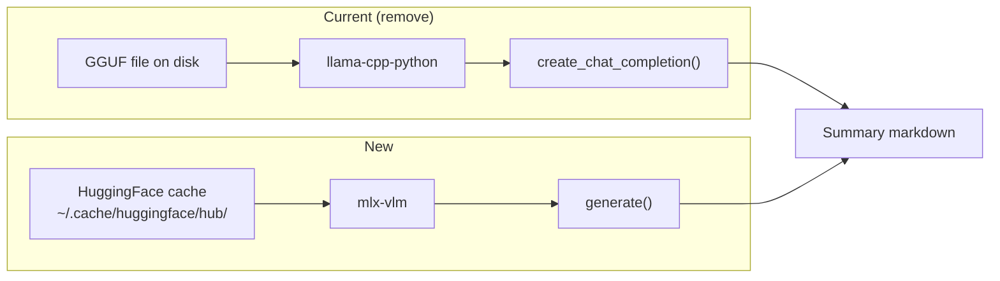

# Qwen3.5 MLX Summarization Engine

- **Version**: 1.0
- **Date**: 2026-03-19
- **Status**: Implemented
- **Author**: meetcap

This specification defines the migration of meetcap's LLM summarization backend from llama-cpp-python (GGUF) to mlx-vlm (MLX SafeTensors), adopting the Qwen3.5 model family. It also revamps the summarization prompt for higher-quality output and appends the full transcript to the summary file.

## Problem Statement

### Current State

meetcap uses `llama-cpp-python` to load GGUF-quantized Qwen3-4B models for meeting summarization. This works but has several limitations:

1. **Outdated models**: Qwen3-4B-Thinking (July 2025) is superseded by Qwen3.5 (March 2026), which offers a hybrid DeltaNet+Attention architecture, 262K native context, and stronger reasoning.
2. **GGUF overhead**: The Q8 GGUF files are 4.7 GB each — larger than 4-bit MLX equivalents (~2.9 GB for 4B, ~5.6 GB for 9B) while offering lower quality than native MLX inference on Apple Silicon.
3. **Redundant dependency**: `llama-cpp-python` requires C++ compilation with Metal flags and is the only consumer of that dependency. MLX is already installed for STT (mlx-whisper).
4. **Limited context**: The current default is 32K tokens. Qwen3.5 natively supports 262K tokens, eliminating the need for transcript chunking in most meetings.
5. **Prompt quality**: The current prompt produces acceptable but not exceptional summaries. It does not include the original transcript in the output, making the summary file incomplete as a standalone meeting artifact.

### Goals

1. Replace `llama-cpp-python` with `mlx-vlm` as the LLM inference backend
2. Support `mlx-community/Qwen3.5-4B-MLX-4bit` (default) and `mlx-community/Qwen3.5-9B-MLX-4bit`
3. Remove all GGUF model support and the `llama-cpp-python` dependency
4. Revamp the summarization prompt for best-in-class meeting summaries
5. Append the full transcript to the end of every summary file
6. Update setup wizard, config, download, and verify flows

### Non-Goals

- Vision/image capabilities of Qwen3.5 (text-only usage)
- Supporting non-Apple-Silicon hardware (MLX is Apple Silicon only)
- Changing the STT pipeline
- Supporting models outside the Qwen3.5 MLX family

## Design Overview

### Architecture Change



### Key Decisions

| Decision | Choice | Rationale |
|----------|--------|-----------|
| Inference backend | `mlx-vlm` | Qwen3.5 MLX models are VLMs requiring mlx-vlm; already installs MLX framework shared with mlx-whisper |
| Default model | Qwen3.5-4B-MLX-4bit | 2x faster generation (34.8 vs 19.0 tok/s), 1.7x less memory (4.2 vs 7.0 GB), comparable summary quality |
| Model storage | HuggingFace cache (`~/.cache/huggingface/hub/`) | mlx-vlm handles download and caching via `huggingface_hub`; no custom download logic needed |
| Context window | Managed by model (262K native) | No explicit `n_ctx` config needed; chunking uses a character threshold as a safety net |
| Quantization | 4-bit | Best speed/quality/size trade-off on Apple Silicon; 2.9 GB (4B) and 5.6 GB (9B) |
| Thinking mode | Disabled by default, configurable | Disabled for speed (22s vs 125s). When enabled, `thinking_budget` caps reasoning tokens via mlx-vlm's native support to prevent over-thinking loops. Uses tokenizer's `apply_chat_template(enable_thinking=...)` for proper control. |
| Transcript in output | Appended after summary | Makes the `.summary.md` file a complete standalone artifact |

### Alternatives Rejected

1. **mlx-lm instead of mlx-vlm**: Qwen3.5 models on mlx-community are VLM-architecture models packaged for mlx-vlm. While text-only mlx-lm variants may exist, the mlx-community/Qwen3.5-*-MLX-4bit models are the canonical, well-tested versions.
2. **Keep llama-cpp-python as fallback**: Maintaining two inference backends doubles the surface area for bugs. Since meetcap targets macOS on Apple Silicon exclusively, MLX-only is the right call.
3. **Disable thinking mode**: Thinking mode produces significantly more thorough analysis of the transcript before generating the summary. The token cost is acceptable given MLX's speed.
4. **9B as default**: Benchmarks show the 9B is 2.4x slower (97.7s vs 40.0s for a short transcript) with similar quality. The 4B is the better default; 9B is available for users who want it.

## Detailed Design

### 1. Dependency Changes

**pyproject.toml** — replace `llama-cpp-python` with `mlx-vlm`:

```toml
dependencies = [
    "pynput>=1.8.1",
    "rich>=14.1.0",
    "typer>=0.16.0",
    "tomli>=2.2.1; python_version < '3.11'",
    "toml>=0.10.2",
    "urllib3>=2.5.0",
    "mlx-vlm[torch]>=0.4.0",   # replaces llama-cpp-python
    "psutil>=6.1.0",
]
```

Note: `mlx-vlm[torch]` transitively installs `mlx`, `mlx-lm`, `transformers`, `torch`, `torchvision`, `huggingface-hub`, and `safetensors`. The `[torch]` extra is required because the Qwen3.5 processor includes a `Qwen3VLVideoProcessor` that imports torchvision at load time even when not processing images.

### 2. Configuration Changes

**config.py** — update `DEFAULT_CONFIG`:

```python
"models": {
    # ... (STT config unchanged) ...
    "llm_model_name": "mlx-community/Qwen3.5-4B-MLX-4bit",     # CHANGED: now a HF repo ID (was "Qwen3-4B-Thinking-2507-Q8_K_XL.gguf")
    # REMOVED: "llm_gguf_path" key entirely
},
"llm": {
    "max_tokens": 4096,
    "temperature": 0.4,
    # REMOVED: n_ctx, n_threads, n_gpu_layers, n_batch (MLX manages these internally)
},
```

**Environment variable changes**:

| Variable | Old Behavior | New Behavior |
|----------|-------------|--------------|
| `MEETCAP_LLM_MODEL` | Path to GGUF file, mapped to `models.llm_gguf_path` | HuggingFace repo ID, mapped to `models.llm_model_name` |
| `MEETCAP_N_CTX` | Set context window size | Remove from env mapping |
| `MEETCAP_N_THREADS` | Set CPU thread count | Remove from env mapping |
| `MEETCAP_N_GPU_LAYERS` | Set Metal GPU layers | Remove from env mapping |

The `_apply_env_overrides()` mapping for `MEETCAP_LLM_MODEL` changes from `("models", "llm_gguf_path")` to `("models", "llm_model_name")`.

**Config migration**: When loading a config that contains `llm_gguf_path`, migrate to the new format:

```python
def _migrate_config(self) -> None:
    # ... existing migrations ...

    # migrate from GGUF to MLX model config
    models = self.config.get("models", {})
    needs_llm_migration = (
        "llm_gguf_path" in models
        or models.get("llm_model_name", "").endswith(".gguf")
    )
    if needs_llm_migration:
        console.print("[dim]migrating llm config from GGUF to MLX...[/dim]")
        # remove old GGUF-specific keys
        models.pop("llm_gguf_path", None)
        # set new HF model name (overwrites old GGUF filename)
        models["llm_model_name"] = "mlx-community/Qwen3.5-4B-MLX-4bit"
        # remove obsolete llm tuning keys (MLX manages these)
        for key in ["n_ctx", "n_threads", "n_gpu_layers", "n_batch"]:
            self.config.get("llm", {}).pop(key, None)
        self.save()
```

### 3. Summarization Service Rewrite

**summarization.py** — replace `Llama` with `mlx-vlm`:

```python
"""llm-based meeting summarization using qwen3.5 via mlx"""

import re
import time
from pathlib import Path

from rich.console import Console
from rich.progress import Progress, SpinnerColumn, TextColumn

console = Console()


class SummarizationService:
    """generate meeting summaries using local mlx llm"""

    def __init__(
        self,
        model_name: str = "mlx-community/Qwen3.5-4B-MLX-4bit",
        temperature: float = 0.4,
        max_tokens: int = 4096,
    ):
        self.model_name = model_name
        self.temperature = temperature
        self.max_tokens = max_tokens
        self.model = None
        self.processor = None
        self.config = None

    def _load_model(self) -> None:
        """lazy load the mlx model."""
        if self.model is not None:
            return

        try:
            from mlx_vlm import load
            from mlx_vlm.utils import load_config
        except ImportError as e:
            raise ImportError(
                "mlx-vlm not installed. install with: pip install 'mlx-vlm[torch]'"
            ) from e

        console.print(f"[cyan]loading llm model {self.model_name}...[/cyan]")

        # offline-first: models must be pre-downloaded via setup wizard or
        # ensure_mlx_llm_model(). If the model is not cached, load() will attempt
        # a network download. The CLI should check verify_mlx_llm_model() first
        # and prompt the user to run `meetcap setup` if the model is missing.
        self.model, self.processor = load(self.model_name)
        self.config = load_config(self.model_name)
        # note: stop tokens (e.g. <|im_end|>) are handled automatically by
        # mlx-vlm via the model's generation_config.json — no manual stop list needed.

    def load_model(self) -> None:
        """explicitly load the llm model."""
        self._load_model()

    def unload_model(self) -> None:
        """unload model and cleanup resources."""
        if self.model is not None:
            del self.model
            del self.processor
            self.model = None
            self.processor = None
            self.config = None

            try:
                import mlx.core as mx
                mx.clear_cache()
            except (ImportError, AttributeError):
                pass

            import gc
            gc.collect()
            console.print("[dim]llm model unloaded[/dim]")

    def is_loaded(self) -> bool:
        """check if model is currently loaded."""
        return self.model is not None

    def _generate_summary(self, system_prompt: str, user_prompt: str) -> str:
        """generate summary using mlx-vlm."""
        from mlx_vlm import generate
        from mlx_vlm.prompt_utils import apply_chat_template

        # format with system prompt via chat template
        formatted = apply_chat_template(
            self.processor, self.config, user_prompt,
            system=system_prompt, num_images=0,
        )

        result = generate(
            self.model, self.processor, formatted,
            max_tokens=self.max_tokens,
            temperature=self.temperature,
            verbose=False,
        )

        # extract text from GenerationResult
        if hasattr(result, "text"):
            raw_output = result.text
        elif isinstance(result, str):
            raw_output = result
        else:
            raw_output = str(result)

        # clean thinking tags
        cleaned = self._clean_thinking_tags(raw_output)

        if not cleaned or len(cleaned) < 10:
            console.print("[yellow]warning: output seems very short after cleaning[/yellow]")

        return cleaned
```

**Preserved methods** (structurally unchanged):
- `summarize()` — same flow, but the chunking threshold changes from `self.n_ctx * 3` (which depended on the removed `n_ctx` parameter) to a fixed `500_000` character constant (~125K tokens). This is a safety net; Qwen3.5's 262K context means most meetings will not trigger chunking.
- `_clean_thinking_tags()` — unchanged, verified working with Qwen3.5 `<think>` output.
- `_chunk_transcript()` — unchanged.

**Removed methods**:
- `get_memory_usage()` — was only used for optional memory reporting. The `psutil`-based implementation remains available if needed but is not part of the MLX service interface. Memory reporting can use `mlx.core.metal.get_active_memory()` instead if re-added later.

### 4. Constructor Change in CLI

**cli.py** — update `_process_transcript_to_summary`:

```python
def _process_transcript_to_summary(
    self,
    transcript_path: Path,
    base_path: Path,
    llm_model: str | None = None,    # now expects HF repo ID, not file path
) -> Path | None:
    # seed parameter removed (see note in Section 7)

    if llm_model:
        model_name = llm_model
    else:
        model_name = self.config.get("models", "llm_model_name")

    # check model is available before loading into GPU memory
    if not llm_model:  # only check default; user-provided models are trusted
        from meetcap.services.model_download import verify_mlx_llm_model
        if not verify_mlx_llm_model(model_name):
            console.print("[red]llm model not found. run 'meetcap setup' to download.[/red]")
            return None

    llm_config = self.config.get_section("llm")

    llm_service = SummarizationService(
        model_name=model_name,
        temperature=llm_config.get("temperature", 0.4),
        max_tokens=llm_config.get("max_tokens", 4096),
    )

    # ... load, summarize, save (as before) ...
    # key change: pass transcript_text to save_summary
    summary_path = save_summary(summary, base_path, transcript_text=transcript_text)
```

### 5. Model Download & Verification

Replace `ensure_qwen_model` and `verify_qwen_model` with MLX equivalents:

```python
def ensure_mlx_llm_model(
    model_name: str = "mlx-community/Qwen3.5-4B-MLX-4bit",
) -> bool:
    """ensure mlx llm model is available, downloading if necessary.

    uses snapshot_download to fetch model files to HF cache without
    loading them into GPU memory (avoids ~4GB allocation during setup).
    """
    try:
        from huggingface_hub import snapshot_download

        console.print(f"[cyan]downloading llm model '{model_name}'...[/cyan]")
        console.print("[dim]this may take several minutes on first run[/dim]")
        snapshot_download(repo_id=model_name)
        console.print(f"[green]✓[/green] llm model ready: {model_name}")
        return True
    except Exception as e:
        console.print(f"[red]error downloading llm model:[/red] {e}")
        return False


def verify_mlx_llm_model(
    model_name: str = "mlx-community/Qwen3.5-4B-MLX-4bit",
) -> bool:
    """verify mlx llm model is available for use."""
    import importlib.util
    import platform

    if platform.processor() != "arm":
        console.print("[yellow]warning: mlx requires Apple Silicon (M1/M2/M3/M4)[/yellow]")
        return False

    if importlib.util.find_spec("mlx_vlm") is None:
        console.print("[yellow]warning: mlx-vlm not installed[/yellow]")
        return False

    try:
        from huggingface_hub import try_to_load_from_cache

        config_path = try_to_load_from_cache(model_name, "config.json")
        if config_path is not None:
            console.print(f"[green]✓[/green] llm model cached: {model_name}")
            return True
        else:
            console.print(f"[yellow]warning: llm model not cached: {model_name}[/yellow]")
            return False
    except Exception as e:
        console.print(f"[red]error verifying llm model:[/red] {e}")
        return False
```

### 6. Setup Wizard Update

**cli.py** — replace step 7 LLM model selection:

```python
# model list for step 7
llm_models = [
    {
        "key": "4b",
        "name": "Qwen3.5-4B",
        "repo": "mlx-community/Qwen3.5-4B-MLX-4bit",
        "desc": "Fast, low memory (default)",
        "size": "~2.9 GB",
    },
    {
        "key": "9b",
        "name": "Qwen3.5-9B",
        "repo": "mlx-community/Qwen3.5-9B-MLX-4bit",
        "desc": "Higher quality, more memory",
        "size": "~5.6 GB",
    },
]

# after user selects and confirms download:
from meetcap.services.model_download import ensure_mlx_llm_model

llm_choice = llm_models[model_idx]
if ensure_mlx_llm_model(llm_choice["repo"]):
    config.config["models"]["llm_model_name"] = llm_choice["repo"]
    config.save()
```

### 7. Prompt Revamp

The current prompt is adequate but can be significantly improved. The new prompt:

- Enforces strict markdown heading structure (`##` headings) for reliable parsing
- Requests richer detail in each section
- Adds a Sentiment/Tone section for meeting atmosphere
- Improves action item formatting with clearer ownership
- Instructs the model to attribute quotes and points to speakers when diarization is available

**System prompt (with speaker info)**:

```
You are a world-class executive assistant who produces comprehensive, publication-quality meeting summaries. You will receive a meeting transcript that includes speaker labels.

Produce a summary with EXACTLY these markdown sections, in this order:

## Meeting Title
A concise 2-4 word title in PascalCase with no spaces (e.g., Q1RevenueReview, ProductRoadmapPlanning).
Write only the title on a single line.

## Summary
A thorough 3-5 paragraph narrative covering:
- The meeting's purpose and context
- Major topics discussed, attributed to speakers where relevant
- Key data points, metrics, and examples mentioned
- Outcomes, consensus reached, and overall direction
- Unresolved questions or tensions

## Participants
For each speaker identified in the transcript:
- Their apparent role based on their contributions
- Their key positions or arguments
- Whether they led the meeting or a specific topic

## Key Discussion Points
5-10 detailed bullet points, each 1-3 sentences:
- Attribute points to specific speakers
- Include supporting data or examples mentioned
- Note any disagreements or alternative viewpoints

## Decisions Made
Bullet list of all decisions, including:
- What was decided and the rationale
- Who made or championed the decision
- Any conditions or caveats
If none, write: "No formal decisions were recorded."

## Action Items
Use this exact format for each item:
- [ ] **Owner (Speaker X)** — Task description (due: YYYY-MM-DD or TBD)
Include context for why the action is needed.
If none, write: "No action items were identified."

## Notable Quotes
2-4 verbatim quotes that capture key insights, decisions, or turning points. Include speaker attribution.

## Meeting Tone
One sentence describing the overall tone and energy of the meeting (e.g., "Collaborative and optimistic, with urgency around the SSO deadline.").

IMPORTANT RULES:
- DO NOT use actual participant names. The transcription system is unreliable with names. Refer to speakers only by their labels (Speaker 1, Speaker 2, etc.).
- DO NOT expand acronyms. Write them exactly as spoken.
- DO NOT include thinking tags, meta-commentary, or preamble.
- Use markdown formatting throughout.
```

**System prompt (without speaker info)**:

```
You are a world-class executive assistant who produces comprehensive, publication-quality meeting summaries.

Produce a summary with EXACTLY these markdown sections, in this order:

## Meeting Title
A concise 2-4 word title in PascalCase with no spaces (e.g., Q1RevenueReview, ProductRoadmapPlanning).
Write only the title on a single line.

## Summary
A thorough 3-5 paragraph narrative covering:
- The meeting's purpose and context
- Major topics discussed
- Key data points, metrics, and examples mentioned
- Outcomes, consensus reached, and overall direction
- Unresolved questions or tensions

## Key Discussion Points
5-10 detailed bullet points, each 1-3 sentences:
- Include supporting data or examples mentioned
- Note any disagreements or alternative viewpoints

## Decisions Made
Bullet list of all decisions, including:
- What was decided and the rationale
- Any conditions or caveats
If none, write: "No formal decisions were recorded."

## Action Items
Use this exact format for each item:
- [ ] **Owner** — Task description (due: YYYY-MM-DD or TBD)
If no owner is clear, use "TBD" as owner.
If none, write: "No action items were identified."

## Notable Quotes
2-4 verbatim quotes that capture key insights, decisions, or turning points.

## Meeting Tone
One sentence describing the overall tone and energy of the meeting.

IMPORTANT RULES:
- DO NOT use actual participant names. The transcription system is unreliable with names. Refer to participants generically (e.g., "one participant noted", "a team member raised").
- DO NOT expand acronyms. Write them exactly as spoken.
- DO NOT include thinking tags, meta-commentary, or preamble.
- Use markdown formatting throughout.
```

**Note on `seed` parameter**: The current `SummarizationService` accepts a `seed` parameter for reproducibility, which `llama-cpp-python` supports natively. The `mlx-vlm` `generate()` function does not expose a `seed` parameter — MLX uses `mx.random.seed()` globally. If seed support is needed, call `mx.random.seed(seed)` before `generate()`. For now, the `seed` parameter is removed from the constructor since reproducible summarization is not a user-facing feature.

### 8. Transcript Appended to Summary Output

**save_summary** in `summarization.py` — append the full transcript after the summary:

```python
def save_summary(summary_text: str, base_path: Path, transcript_text: str = "") -> Path:
    """save summary to markdown file, with transcript appended."""
    summary_path = base_path.with_suffix(".summary.md")

    from datetime import datetime
    header = (
        f"# Meeting Summary\n"
        f"*Generated: {datetime.now().strftime('%Y-%m-%d %H:%M')}*\n\n---\n\n"
    )

    parts = [header, summary_text]

    if transcript_text:
        parts.append("\n\n---\n\n## Full Transcript\n\n")
        parts.append(transcript_text)

    final_content = "".join(parts)

    with open(summary_path, "w", encoding="utf-8") as f:
        f.write(final_content)

    console.print(f"[green]✓[/green] summary saved: {summary_path}")
    return summary_path
```

The caller in `cli.py` must pass `transcript_text` to `save_summary`:

```python
summary_path = save_summary(summary, base_path, transcript_text=transcript_text)
```

### 9. Cleanup of Old Models

The following are removed entirely:

| Item | Action |
|------|--------|
| `ensure_qwen_model()` | Delete function |
| `verify_qwen_model()` | Delete function |
| `download_gguf_model()` | Delete function |
| GGUF model URL constants | Delete |
| `llama-cpp-python` dependency | Remove from `pyproject.toml` |
| `llm_gguf_path` config key | Remove, add migration |
| `n_ctx`, `n_threads`, `n_gpu_layers`, `n_batch` config keys | Remove from `llm` section |
| `MEETCAP_N_CTX`, `MEETCAP_N_THREADS`, `MEETCAP_N_GPU_LAYERS` env vars | Remove |

Users with existing GGUF files in `~/.meetcap/models/` are not affected — the files are simply no longer referenced. A future `meetcap cleanup` command could remove them, but that is out of scope.

## Edge Cases & Error Handling

| Scenario | Handling |
|----------|----------|
| `mlx-vlm` not installed | `ImportError` with install instructions |
| Not running on Apple Silicon | Check `platform.processor() == "arm"` at verify time; warn in setup |
| Model not cached and no internet | `huggingface_hub` raises `ConnectionError`; catch and display user-friendly message |
| Insufficient disk space | `huggingface_hub` raises `RuntimeError`; catch and suggest clearing cache |
| Transcript exceeds context window | Retain chunking logic with 500K char threshold (~125K tokens); merge chunk summaries |
| Thinking tags in output | Existing `_clean_thinking_tags()` handles `<think>` and `<thinking>` tags — verified working with Qwen3.5 |
| Empty or very short output | Warn user, return what was generated |
| `torchvision` not installed | `mlx-vlm[torch]` must be installed; error message guides user |
| Old config with `llm_gguf_path` | Automatic migration to new MLX config on first load |
| `mx.metal.clear_cache` deprecation | Use `mx.clear_cache()` (the old API already emits a deprecation warning) |
| `--llm-model` CLI flag passed with old GGUF path | The flag now expects a HF repo ID; passing a file path will fail at `mlx_vlm.load()` with a clear error. Help text updated to show the new format. |
| Runtime model download attempt (offline-first) | `mlx_vlm.load()` may attempt network access if the model is not cached. The architecture requires offline runtime. Mitigation: setup wizard ensures the model is downloaded; if the model is missing at runtime, display a "run `meetcap setup`" message instead of attempting download. |

## File Changes

| File | Action | Description |
|------|--------|-------------|
| `pyproject.toml` | Modify | Replace `llama-cpp-python>=0.3.15` with `mlx-vlm[torch]>=0.4.0` |
| `meetcap/services/summarization.py` | Rewrite | Replace llama-cpp-python with mlx-vlm; new prompt; transcript append |
| `meetcap/services/model_download.py` | Modify | Remove `download_gguf_model`, `ensure_qwen_model`, `verify_qwen_model`; add `ensure_mlx_llm_model`, `verify_mlx_llm_model` |
| `meetcap/utils/config.py` | Modify | Update `DEFAULT_CONFIG`, add migration for old GGUF config, remove obsolete env vars |
| `meetcap/cli.py` | Modify | Update `_process_transcript_to_summary` constructor, setup wizard step 7, verify command, summarize/reprocess commands |
| `tests/test_summarization.py` | Rewrite | Update mocks from llama-cpp to mlx-vlm; test new prompt structure |
| `tests/test_model_download.py` | Modify | Update tests for new download/verify functions |
| `tests/test_config.py` | Modify | Test GGUF-to-MLX migration |
| `CLAUDE.md` | Modify | Update architecture section for MLX LLM |
| `.claude/rules/architecture.md` | Modify | Update "LLM Summarization" section: Qwen3.5 via mlx-vlm replaces Qwen3 via llama-cpp-python |
| `.claude/rules/development.md` | Modify | Update `MEETCAP_LLM_MODEL` env var description |

## Testing Strategy

### Unit Tests

1. **SummarizationService init**: verify model_name stored, model not loaded until first use
2. **_load_model mock**: mock `mlx_vlm.load` and `load_config`; verify called once
3. **_generate_summary mock**: mock `mlx_vlm.generate` and `apply_chat_template`; verify prompt formatting and result extraction
4. **_clean_thinking_tags**: existing tests remain valid — verify with Qwen3.5-style thinking output
5. **unload_model**: verify model/processor set to None, `mx.clear_cache()` called
6. **save_summary with transcript**: verify transcript appended after `---` separator
7. **Config migration**: verify old `llm_gguf_path` config migrates to new `llm_model_name`
8. **ensure_mlx_llm_model**: mock `huggingface_hub.snapshot_download`; verify download triggered
9. **verify_mlx_llm_model**: mock `huggingface_hub.try_to_load_from_cache`; verify cache check

### Manual Validation

1. `uv run meetcap setup` — verify LLM step offers 4B/9B choice and downloads work
2. `uv run meetcap verify` — verify MLX LLM model check passes
3. `uv run meetcap summarize` — run on a real recording, verify:
   - Summary quality matches or exceeds old GGUF output
   - All markdown sections present
   - Transcript appended at end of `.summary.md`
   - Thinking tags cleaned from output
4. `uv run meetcap reprocess` — verify reprocessing with new engine works
5. Config migration — start with old `config.toml` containing `llm_gguf_path`, verify auto-migration

### Acceptance Criteria

1. `uv run pytest` passes with ≥74% coverage
2. `uv run ruff check . && uv run ruff format --check .` passes
3. `llama-cpp-python` is no longer in any dependency list
4. Default model is `mlx-community/Qwen3.5-4B-MLX-4bit`
5. Summary files contain `## Full Transcript` section at end
6. Setup wizard offers Qwen3.5-4B (default) and Qwen3.5-9B options
7. Old configs with `llm_gguf_path` auto-migrate on first load

## Benchmark Reference

Tested on Apple Silicon (M3 Max), 2026-03-19. Transcript: ~630 input tokens, ~1400 output tokens.

| Metric | Qwen3.5-4B-MLX-4bit | Qwen3.5-9B-MLX-4bit |
|--------|----------------------|----------------------|
| Disk size | ~2.9 GB | ~5.6 GB |
| Load time (cached) | 2.2s | 4.0s |
| Prompt throughput | 284.9 tok/s | 156.1 tok/s |
| Generation throughput | 34.8 tok/s | 19.0 tok/s |
| Summary generation time | 40.0s | 97.7s* |
| Peak GPU memory (Metal) | 4.2 GB | 7.0 GB |
| Context window | 262K tokens | 262K tokens |

*9B generation time includes first-run model weight loading overhead; subsequent runs with warm cache are faster.
