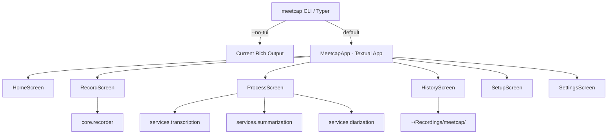
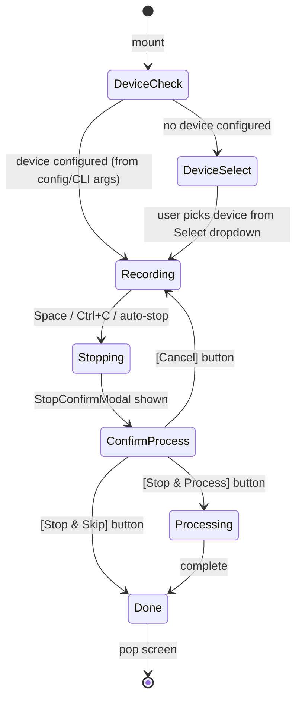

# Full-Screen TUI for meetcap

- **Version**: 1.0
- **Date**: 2026-03-20
- **Status**: Implemented
- **Type**: Feature spec (major)

---

## 1. Summary

Replace meetcap's current line-by-line Rich console output with a full-screen Textual TUI that provides a polished, real-time, keyboard-driven experience for recording, transcribing, and summarizing meetings. The TUI will give users an at-a-glance dashboard during recording, live progress during processing, browsable history of past recordings, and an interactive setup wizard -- all within a single, cohesive terminal application.

---

## 2. Problem Statement

### Current State

meetcap's UI is built with Rich (Panels, Tables, Spinners) and Typer, producing sequential line-by-line output. During recording, a single `\r`-overwritten line shows elapsed time. Processing shows interleaved spinners and status messages. There is no persistent layout, no navigable history, no live audio visualization, and no way to see system status alongside recording progress.

### Goals

| # | Goal | Rationale |
|---|------|-----------|
| G1 | Full-screen TUI with persistent layout | Users see all relevant info simultaneously without scrolling |
| G2 | Real-time recording dashboard | Live elapsed time, audio level meter, timer, device info, notes path |
| G3 | Live processing pipeline view | See STT and LLM progress with stage indicators and timing |
| G4 | Recording history browser | Browse, search, and reprocess past recordings without leaving the app |
| G5 | Interactive setup/config | Guided wizard within the TUI, replacing sequential prompts |
| G6 | Keyboard-first, mouse-supported | Full keyboard navigation with discoverable shortcuts |
| G7 | Theme system | Built-in dark/light themes using Textual's theme engine |
| G8 | Preserve CLI mode | `meetcap record --no-tui` retains current Rich-based output for scripts/CI |

### Non-Goals

- Web UI (Textual-web is out of scope for v1)
- Audio waveform rendering (terminal resolution makes this impractical beyond a level meter)
- Real-time transcript streaming (STT engines process post-recording)
- Mobile/tablet support
- Plugin/extension system for the TUI

### Command Coverage

Every existing CLI command must have a TUI equivalent:

| CLI Command | TUI Equivalent |
|-------------|---------------|
| `meetcap` (no args) | Launch HomeScreen |
| `meetcap record` | HomeScreen -> RecordScreen |
| `meetcap summarize <file>` | Launch ProcessScreen directly with file arg |
| `meetcap reprocess <dir>` | Launch HistoryScreen with target pre-selected, auto-trigger reprocess |
| `meetcap devices` | SettingsScreen > Audio section (device list integrated) |
| `meetcap setup` | SetupScreen (also shown on first run) |
| `meetcap verify` | SettingsScreen > Verify action, or command palette "Run System Verify" |

---

## 3. Design Overview

### 3.1 Framework Choice: Textual

**Textual** (by Textualize, built on Rich) is the clear choice:

| Criterion | Textual | curses/urwid | Bubble Tea (Go) |
|-----------|---------|--------------|------------------|
| Language | Python (native) | Python | Go (wrong language) |
| CSS styling | Yes (TCSS) | No | No |
| Widget library | 50+ built-in | Minimal | Moderate |
| Async support | Native asyncio | Manual | Goroutines |
| Rich integration | Direct (same team) | None | None |
| Theme system | Built-in (nord, gruvbox, tokyo-night, etc.) | None | None |
| Testing | Snapshot testing, pilot | Manual | teatest |
| Community | 35K stars, active | Mature but stagnant | Active but Go-only |

**Inspiration apps** (all built with Textual): Dolphie (MySQL monitor), Harlequin (DuckDB IDE), Posting (HTTP client), Elia (AI chat client), textual-system-monitor.

### 3.2 Architecture



The TUI is a **new presentation layer** that orchestrates the same core services (`AudioRecorder`, STT services, `SummarizationService`, `DiarizationService`).

> **Important caveat**: The current services hardcode `console.print()` calls (Rich Console) throughout their methods. When run inside Textual worker threads, these calls will corrupt the TUI screen buffer. This requires one of:
> 1. **Redirect console** (simplest): Before invoking a service in a worker, replace the module-level `console` with `Console(file=io.StringIO())` to suppress output, capturing it for the TUI's `RichLog` instead.
> 2. **Callback refactor** (cleanest, future work): Refactor services to accept an optional progress callback instead of printing directly.
>
> Option 1 is used for the initial TUI implementation. Option 2 is deferred to a follow-up refactor.
>
> **Note**: Services also use `rich.progress.Progress` context managers (spinners, progress bars) that write directly to the terminal. These are suppressed by the same console redirection strategy -- the Progress objects bind to the module's `console` instance.

The TUI uses `AudioRecorder` directly -- **not** `RecordingOrchestrator` (which has its own signal handling and `console.print()` calls). The orchestration logic (device selection, STT/LLM dispatch, file organization) is reimplemented in TUI screen handlers.

### 3.3 Key Design Decisions

| Decision | Choice | Alternative Rejected | Reasoning |
|----------|--------|---------------------|-----------|
| Entry point | `meetcap` launches TUI; `meetcap record --no-tui` for headless | Separate `meetcap-tui` command | Single entry point is simpler; TUI is the primary experience |
| Screen architecture | Multi-screen app with push/pop navigation | Single screen with tab switching | Screens have natural lifecycle (mount/unmount), better for resource management |
| Worker threads | Textual `@work` decorator for all I/O | Raw threading | `@work` integrates with Textual's message system and cancellation |
| State management | Reactive attributes on App and Screens | External state store | Textual's reactive system auto-triggers UI updates, less boilerplate |
| CSS organization | One `.tcss` file per screen + shared `theme.tcss` | Single monolithic CSS | Maintainability, parallel development |
| CLI fallback | `--no-tui` flag on `record`, `summarize`, `reprocess` | Env var `MEETCAP_NO_TUI` | Explicit per-command is clearer; env var also supported for CI |

---

## 4. Detailed Design

### 4.1 App Shell

The root `MeetcapApp` provides the persistent chrome: header, footer, command palette, and notifications.

```python
class MeetcapApp(App):
    """meetcap terminal user interface."""

    TITLE = "meetcap"

    # CSS_PATH is relative to this Python file (meetcap/tui/app.py)
    # so "css/theme.tcss" resolves to meetcap/tui/css/theme.tcss
    CSS_PATH = [
        "css/theme.tcss",
        "css/home.tcss",
        "css/record.tcss",
        "css/process.tcss",
        "css/history.tcss",
        "css/setup.tcss",
        "css/modals.tcss",
    ]

    # Screen registry -- maps names to Screen classes for push_screen("name")
    SCREENS = {
        "home": HomeScreen,
        "record": RecordScreen,
        "process": ProcessScreen,
        "history": HistoryScreen,
        "settings": SettingsScreen,
        "setup": SetupScreen,
    }

    BINDINGS = [
        Binding("r", "push_screen('record')", "Record", show=True),
        Binding("h", "push_screen('history')", "History", show=True),
        Binding("s", "push_screen('settings')", "Settings", show=True),
        Binding("ctrl+p", "command_palette", "Commands", show=False),
        Binding("q", "quit", "Quit", show=True),
        Binding("?", "action_show_keys", "Help", show=True),  # built-in Textual keys overlay
    ]
    COMMANDS = App.COMMANDS | {MeetcapCommands}
    ENABLE_COMMAND_PALETTE = True

    def __init__(
        self,
        initial_screen: str = "home",
        record_args: dict | None = None,
        process_file: Path | None = None,
    ):
        super().__init__()
        self._initial_screen = initial_screen
        self._record_args = record_args or {}
        self._process_file = process_file
        self.config = Config()

    def on_mount(self) -> None:
        """Called when app is mounted. Handle first-run and initial screen."""
        # Register custom theme
        self.register_theme(MEETCAP_DARK)
        self.theme = "meetcap-dark"

        # Check first-run
        if not self.config.is_configured():
            self.push_screen("setup")
        elif self._initial_screen != "home":
            self.push_screen(self._initial_screen)
```

**Header**: Custom header showing `meetcap v{version}` + clock + system status indicators (mic active, memory usage).

**Footer**: Textual's built-in `Footer` with context-sensitive key bindings per screen.

**Command Palette** (Ctrl+P): Quick access to all actions -- start recording, open history, change device, switch theme, run setup.

**Toast Notifications**: Non-blocking alerts for events like "recording saved", "transcription complete", "model download finished".

### 4.2 Screen: Home (Default)

The landing screen shown when `meetcap` is launched without arguments.

```
+------------------------------------------------------------------+
| meetcap v1.4.0                              12:34 PM   [MIC OK]  |
+------------------------------------------------------------------+
|                                                                   |
|                         meetcap                                   |
|                    offline meeting capture                        |
|                                                                   |
|    +-- Quick Actions -----------------------------------------+   |
|    |                                                          |   |
|    |   [R]  Start Recording     [H]  Browse History           |   |
|    |   [S]  Settings            [V]  System Verify            |   |
|    |   [?]  Help                [Q]  Quit                     |   |
|    |                                                          |   |
|    +----------------------------------------------------------+   |
|                                                                   |
|    +-- Recent Recordings -------------------------------------+   |
|    |  2026_Mar_19_TeamStandup     12m  3 speakers  summary OK |   |
|    |  2026_Mar_18_DesignReview    45m  5 speakers  summary OK |   |
|    |  2026_Mar_17_1on1            22m  2 speakers  summary OK |   |
|    +----------------------------------------------------------+   |
|                                                                   |
|    +-- System Status -----------------------------------------+   |
|    |  Device: BlackHole+Mic (Aggregate)     STT: Parakeet TDT |   |
|    |  LLM: Qwen3.5-4B-MLX-4bit             Disk: 42 GB free  |   |
|    +----------------------------------------------------------+   |
|                                                                   |
+------------------------------------------------------------------+
| R Record  H History  S Settings  ? Help  Q Quit     Ctrl+P Cmds |
+------------------------------------------------------------------+
```

**Widgets**:
- `QuickActions` -- grid of clickable action buttons
- `RecentRecordings` -- `DataTable` showing last 5 recordings with metadata
- `SystemStatus` -- live indicators for device, STT engine, LLM model, disk space

**Behavior**:
- Recent recordings list is populated on mount by scanning `~/Recordings/meetcap/`
- System status checks run as `@work` tasks to avoid blocking mount
- Clicking/Enter on a recent recording opens it in HistoryScreen

### 4.3 Screen: Record

The primary recording interface. Replaces the current `\r`-based progress line.

```
+------------------------------------------------------------------+
| meetcap v1.4.0                              12:34 PM  RECORDING  |
+------------------------------------------------------------------+
|                                                                   |
|                      +------------------+                         |
|                      |    05:23.47      |    <-- Digits widget    |
|                      +------------------+                         |
|                                                                   |
|    +-- Audio ------------------------------------------------+    |
|    |  Device: BlackHole 2ch + MacBook Pro Microphone          |   |
|    |  Format: OPUS 32kbps  Rate: 48000 Hz  Channels: 2       |   |
|    |  Level: ||||||||||||||||||||..........  -12 dB            |   |
|    |         ^^^^^^^^^^^^^^^^^^^^^^^^^^^^^^^^ Sparkline       |   |
|    +----------------------------------------------------------+   |
|                                                                   |
|    +-- Timer -------------------------------------------------+   |
|    |  Auto-stop: 60 min          Remaining: 54:36             |   |
|    |  [E] Extend +30m  [C] Cancel timer  [1][2][3] Quick set  |   |
|    +----------------------------------------------------------+   |
|                                                                   |
|    +-- Notes -------------------------------------------------+   |
|    |  /Users/juan/Recordings/meetcap/tmp_.../notes.md          |   |
|    |  Tip: edit this file during the meeting to add context    |   |
|    +----------------------------------------------------------+   |
|                                                                   |
|    +-- Log ---------------------------------------------------+   |
|    |  12:29:00  Recording started                              |   |
|    |  12:29:01  Device: BlackHole+Mic (index 3)                |   |
|    |  12:34:23  Timer extended by 30 minutes                   |   |
|    +----------------------------------------------------------+   |
|                                                                   |
+------------------------------------------------------------------+
| Space Stop  E Extend  C Cancel Timer  Esc Back            Ctrl+P |
+------------------------------------------------------------------+
```

**Widgets**:
- `RecordingDigits` -- large `Digits` widget showing elapsed time (HH:MM:SS.ss), auto-updated at 10fps via `set_interval(1/10, update_time)` (sufficient precision, low overhead)
- `AudioInfoPanel` -- static panel showing device, format, rate
- `AudioLevelMeter` -- `Sparkline` widget updated with audio level data from FFmpeg stderr parsing, showing recent ~30s of peak levels
- `TimerPanel` -- shows auto-stop countdown (if active), with inline key hints for timer operations
- `NotesPanel` -- shows notes file path and tip
- `RecordingLog` -- `RichLog` widget for timestamped events (start, stop, timer changes, errors)

**State Machine**:



**DeviceCheck/DeviceSelect**: On mount, if a device is configured (via CLI `--device` arg, config.toml `audio.preferred_device`, or auto-detection via `select_best_device()`), skip directly to Recording. If no device is found, show a `Select` dropdown populated from `list_audio_devices()`. The device selection also shows whether to use single or dual-input recording (aggregate device detection from `core/devices.py`).

**Auto-stop timer selection**: During the Recording state, the TimerPanel shows timer controls. If no `--auto-stop` was passed from CLI, the timer starts inactive. Users set it via keyboard shortcuts (`1`/`2`/`3` for 30/60/90 min). This replaces the current interactive Typer prompt which would conflict with Textual.

**Key Bindings**:
| Key | Action |
|-----|--------|
| `Space` | Stop recording |
| `e` | Extend timer +30m |
| `c` | Cancel timer |
| `1` / `2` / `3` | Quick-set timer to 30/60/90 min |
| `Escape` | Confirm stop + go back |

**Audio Level Meter** (Phase 2 enhancement): FFmpeg can output audio level info via `-af astats=metadata=1:reset=1` filter on stderr. A worker thread would parse these lines and post `AudioLevelUpdate` messages to the Sparkline widget. However, this requires:
1. Modifying `recorder.py`'s FFmpeg command to add the `-af astats` filter
2. Non-blocking stderr reading to avoid subprocess deadlock
3. Testing to confirm the filter doesn't affect audio quality

**For v1**: The `AudioLevelMeter` widget shows a static "recording active" indicator (pulsing red dot). Real-time levels are deferred to a follow-up. The widget interface (`AudioLevelUpdate` message) is designed now so the Sparkline can be wired up later without changing the screen layout.

### 4.4 Screen: Process

Shown after recording stops (if user confirms processing), or during `meetcap summarize` / `meetcap reprocess`.

```
+------------------------------------------------------------------+
| meetcap v1.4.0                             12:40 PM  PROCESSING  |
+------------------------------------------------------------------+
|                                                                   |
|    +-- Pipeline ----------------------------------------------+   |
|    |                                                          |   |
|    |   [====] STT (Parakeet TDT)         DONE  23.4s  16.2x  |   |
|    |   [====] Diarization (sherpa-onnx)   DONE   4.1s         |   |
|    |   [===>] Summarization (Qwen3.5-4B)  IN PROGRESS...      |   |
|    |   [    ] File Organization            PENDING             |   |
|    |                                                          |   |
|    +----------------------------------------------------------+   |
|                                                                   |
|    +-- Details -----------------------------------------------+   |
|    |  Audio: recording.opus (12.4 MB, 42:15)                  |   |
|    |  Segments: 342 transcribed                                |   |
|    |  Speakers: 3 identified (clustering threshold: 0.85)     |   |
|    |  Chunks: 1/1 (transcript fits in context window)         |   |
|    +----------------------------------------------------------+   |
|                                                                   |
|    +-- Live Output -------------------------------------------+   |
|    |  Generating summary for chunk 1/1...                      |   |
|    |  Token generation: 847 tokens (42.3 tok/s)                |   |
|    +----------------------------------------------------------+   |
|                                                                   |
+------------------------------------------------------------------+
| Processing... please wait                                Ctrl+P  |
+------------------------------------------------------------------+
```

**Widgets**:
- `PipelineProgress` -- custom widget with 4 stages, each showing a progress bar + status + timing
- `ProcessingDetails` -- static info about the recording being processed
- `LiveOutput` -- `RichLog` showing real-time output from STT/LLM services

**Pipeline Stages**:
1. **STT** -- progress based on audio duration vs elapsed time; shows realtime factor on completion
2. **Diarization** -- indeterminate progress bar (duration not predictable); shows speaker count on completion
3. **Summarization** -- progress based on chunks processed; shows token/s on completion
4. **File Organization** -- title extraction + directory rename; near-instant

Each stage uses a Textual `@work` task. The worker posts `StageUpdate` messages that the screen handles to update the pipeline widget.

### 4.5 Screen: History

Browse and manage past recordings.

```
+------------------------------------------------------------------+
| meetcap v1.4.0                              12:45 PM             |
+------------------------------------------------------------------+
|  Search: [________________]                    Sort: [Date v]     |
+------------------------------------------------------------------+
| Date        | Title              | Duration | Speakers | Files   |
|-------------|--------------------|---------:|----------|---------|
| 2026-03-19  | Team Standup       |    12:04 | 3        | a t s n |
| 2026-03-18  | Design Review      |    45:22 | 5        | a t s   |
| 2026-03-17  | 1-on-1 with Sarah  |    22:11 | 2        | a t s n |
| 2026-03-15  | Sprint Planning    |  1:02:33 | 7        | a t s   |
| 2026-03-14  | Client Call        |    33:45 | 4        | a t s n |
+------------------------------------------------------------------+
|                                                                   |
|  +-- Preview ------------------------------------------------+   |
|  |  # Team Standup - 2026-03-19                               |   |
|  |                                                            |   |
|  |  ## Key Decisions                                          |   |
|  |  - Deploy v2.3 to staging by Thursday                      |   |
|  |  - Juan to review the auth PR before EOD                   |   |
|  |                                                            |   |
|  |  ## Action Items                                           |   |
|  |  - @sarah: Update API docs for new endpoints               |   |
|  |  - @mike: Fix flaky test in CI pipeline                    |   |
|  +------------------------------------------------------------+   |
|                                                                   |
+------------------------------------------------------------------+
| Enter Open  R Reprocess  D Delete  / Search  Esc Back    Ctrl+P  |
+------------------------------------------------------------------+
```

**Widgets**:
- `SearchInput` -- `Input` widget with live filtering
- `SortSelect` -- `Select` for sort order (date, duration, title)
- `RecordingsTable` -- `DataTable` with sortable columns, zebra stripes, cursor navigation
- `SummaryPreview` -- `Markdown` widget showing the selected recording's summary

**File indicators** in the table: `a` = audio, `t` = transcript, `s` = summary, `n` = notes. Color-coded: green if present, dim if missing.

**Key Bindings**:
| Key | Action |
|-----|--------|
| `Enter` | Open recording detail view (full summary + transcript) |
| `r` | Reprocess selected recording (push ProcessScreen) |
| `d` | Delete recording (with confirmation modal) |
| `/` | Focus search input |
| `Up`/`Down` | Navigate table |
| `Escape` | Back to home |

### 4.6 Screen: Settings

Interactive configuration editor replacing the `meetcap setup` sequential wizard.

```
+------------------------------------------------------------------+
| meetcap v1.4.0                              Settings             |
+------------------------------------------------------------------+
|                                                                   |
|  +-- Audio ---------------------------------------------------+  |
|  |  Device:        [BlackHole+Mic (Aggregate)        v]       |  |
|  |  Format:        [OPUS v]  Bitrate: [32 kbps]               |  |
|  |  Sample Rate:   [48000 Hz]  Channels: [2]                  |  |
|  +------------------------------------------------------------+  |
|                                                                   |
|  +-- Speech-to-Text -----------------------------------------+   |
|  |  Engine:        [Parakeet TDT (recommended)       v]       |  |
|  |  Model:         mlx-community/parakeet-tdt-0.6b-v3         |  |
|  |  Status:        Downloaded (1.2 GB)                         |  |
|  +------------------------------------------------------------+  |
|                                                                   |
|  +-- Summarization -------------------------------------------+  |
|  |  Model:         [Qwen3.5-4B-MLX-4bit             v]       |  |
|  |  Temperature:   [0.4]  Max Tokens: [4096]                  |  |
|  |  Status:        Downloaded (2.9 GB)                         |  |
|  +------------------------------------------------------------+  |
|                                                                   |
|  +-- Diarization --------------------------------------------+   |
|  |  Enabled:       [x]                                        |  |
|  |  Backend:       [sherpa v]  Threshold: [0.85]               |  |
|  |  Speakers:      [-1 (auto)]                                 |  |
|  +------------------------------------------------------------+  |
|                                                                   |
|  +-- Output --------------------------------------------------+  |
|  |  Directory:     ~/Recordings/meetcap                        |  |
|  |  Notes:         [x] Create notes.md                         |  |
|  +------------------------------------------------------------+  |
|                                                                   |
+------------------------------------------------------------------+
| Tab Navigate  Enter Edit  V Verify  Esc Back             Ctrl+P  |
+------------------------------------------------------------------+
```

**Widgets**:
- `TabbedContent` with sections: Audio, STT, Summarization, Diarization, Output, Theme
- `Select` dropdowns for engine/model/device selection
- `Input` fields for numeric values
- `Checkbox` for boolean settings
- `ModelStatusIndicator` -- custom widget showing download status + size

Changes are written to `~/.meetcap/config.toml` on save. A "Verify" action (`v`) runs the same checks as `meetcap verify` inline.

### 4.7 Screen: Setup (First-Run Wizard)

Replaces the current 6-step sequential setup. Uses a `TabbedContent` with enforced step order.

Steps:
1. **Dependencies** -- checks FFmpeg, displays results in a table
2. **Permissions** -- guides user through macOS Microphone + Input Monitoring
3. **Audio Device** -- `Select` dropdown populated from `list_audio_devices()`
4. **STT Engine** -- engine selection + model download with `ProgressBar`
5. **LLM Model** -- model selection + download with `ProgressBar`
6. **Output** -- directory picker + notes preference

Each step has a "Next" button that validates before advancing. Model downloads use `@work` tasks with progress callbacks that update a Textual `ProgressBar`.

### 4.8 Modal Dialogs

Used sparingly for confirmations and critical choices:

- **StopConfirmModal** -- "Stop recording? [Stop & Process] [Stop & Skip] [Cancel]"
- **DeleteConfirmModal** -- "Delete recording '{title}'? This cannot be undone. [Delete] [Cancel]"
- **ErrorModal** -- displays error with context-specific suggestions (reuses `ErrorHandler` logic)

Implemented as Textual `ModalScreen` subclasses with `background: $background 30%` for a translucent overlay effect (60% would be nearly opaque).

### 4.9 Command Palette Integration

Custom `CommandProvider` exposing all meetcap actions:

```python
class MeetcapCommands(Provider):
    """Command palette provider for meetcap actions."""

    async def discover(self) -> Hits:
        """Yield all discoverable commands (shown when palette opens with no query)."""
        yield DiscoveryHit(
            display="Start Recording",
            command=partial(self.app.push_screen, "record"),
            help="Begin a new meeting recording",
        )
        yield DiscoveryHit(
            display="Browse History",
            command=partial(self.app.push_screen, "history"),
            help="View past recordings",
        )
        # ... additional commands ...

    async def search(self, query: str) -> Hits:
        """Search commands by query string."""
        commands = [
            ("Start Recording", partial(self.app.push_screen, "record")),
            ("Browse History", partial(self.app.push_screen, "history")),
            ("Open Settings", partial(self.app.push_screen, "settings")),
            ("Run System Verify", self.app.action_verify),
            ("Change Audio Device", self.app.action_change_device),
            ("Switch Theme", self.app.action_switch_theme),
        ]
        matcher = self.matcher(query)
        for name, callback in commands:
            score = matcher.match(name)
            if score > 0:
                yield Hit(score=score, match_display=matcher.highlight(name), command=callback)
```

### 4.10 Theme System

Leverage Textual's built-in theme engine. Ship with curated defaults:

| Theme | Base | Vibe |
|-------|------|------|
| `meetcap-dark` (default) | `textual-dark` | Deep navy/slate with cyan accents |
| `meetcap-light` | `textual-light` | Clean white with blue accents |
| `nord` | Built-in | Textual's nord theme |
| `tokyo-night` | Built-in | Textual's tokyo-night theme |
| `gruvbox` | Built-in | Textual's gruvbox theme |

Custom theme defined in Python (Textual themes are registered via `Theme` class, not TCSS variables):

```python
from textual.theme import Theme

MEETCAP_DARK = Theme(
    name="meetcap-dark",
    primary="#4fc1ff",       # cyan accent
    secondary="#7c8fa6",     # slate
    accent="#ff6b6b",        # coral for recording indicator
    warning="#ffb347",       # amber for processing
    error="#ff4444",         # red for errors
    success="#4ade80",       # green for completed stages
    surface="#1a1e2e",       # deep navy
    panel="#232839",         # slightly lighter navy
    dark=True,
)
```

Semantic aliases used via standard Textual theme variables in TCSS:

```css
/* css/theme.tcss */

/* Recording state: use $error (red) for active recording */
/* Processing state: use $warning (amber) for active processing */
/* Pipeline stages: $success=done, $accent=active, $text-muted=pending */
/* Audio levels: $success=low, $warning=mid, $error=high */

/* These map to the Theme variables registered above */
```

### 4.11 CSS Architecture

```
meetcap/tui/css/
    theme.tcss          # shared variables, base styles
    home.tcss           # HomeScreen layout
    record.tcss         # RecordScreen layout
    process.tcss        # ProcessScreen layout
    history.tcss        # HistoryScreen layout
    settings.tcss       # SettingsScreen layout
    setup.tcss          # SetupScreen layout
    modals.tcss         # all modal dialogs
```

Example `record.tcss`:

```css
RecordScreen {
    layout: vertical;
}

RecordingDigits {
    width: 100%;
    height: 5;
    content-align: center middle;
    text-style: bold;
    color: $recording-active;
}

AudioInfoPanel {
    height: auto;
    margin: 1 2;
    padding: 1;
    background: $panel;
    border: wide $primary;
}

AudioLevelMeter {
    width: 100%;
    height: 3;
    margin: 0 2;
}

AudioLevelMeter > .sparkline--max-color {
    color: $level-high;
}

AudioLevelMeter > .sparkline--min-color {
    color: $level-low;
}

TimerPanel {
    height: auto;
    margin: 1 2;
    padding: 1;
    background: $panel;
    border: tall $secondary;
}

RecordingLog {
    height: 1fr;
    margin: 1 2;
    border: round $primary-muted;
}
```

### 4.12 File Structure

```
meetcap/
    tui/
        __init__.py
        app.py              # MeetcapApp (root App class)
        commands.py          # MeetcapCommands (command palette provider)
        screens/
            __init__.py
            home.py          # HomeScreen
            record.py        # RecordScreen
            process.py       # ProcessScreen
            history.py       # HistoryScreen
            settings.py      # SettingsScreen
            setup.py         # SetupScreen
        widgets/
            __init__.py
            audio_level.py   # AudioLevelMeter (Sparkline wrapper)
            pipeline.py      # PipelineProgress (multi-stage progress)
            recording_digits.py  # RecordingDigits (Digits wrapper)
            system_status.py # SystemStatus panel
            model_status.py  # ModelStatusIndicator
        modals/
            __init__.py
            confirm.py       # StopConfirmModal, DeleteConfirmModal
            error.py         # ErrorModal
        css/
            theme.tcss
            home.tcss
            record.tcss
            process.tcss
            history.tcss
            settings.tcss
            setup.tcss
            modals.tcss
```

### 4.13 Integration with Existing CLI

The Typer CLI remains the entry point. The TUI is launched as the default mode:

```python
# cli.py changes (simplified)

@app.command()
def record(
    # ... existing params ...
    no_tui: bool = typer.Option(False, "--no-tui", help="disable TUI, use classic output"),
):
    if no_tui or os.environ.get("MEETCAP_NO_TUI") or not sys.stdout.isatty():
        # existing Rich-based flow (unchanged)
        orchestrator = RecordingOrchestrator(config)
        orchestrator.run(...)
    else:
        from meetcap.tui.app import MeetcapApp
        app = MeetcapApp(initial_screen="record", record_args={...})
        app.run()

@app.callback(invoke_without_command=True)
def main(ctx: typer.Context):
    if ctx.invoked_subcommand is None:
        # No subcommand = launch TUI home screen
        from meetcap.tui.app import MeetcapApp
        tui = MeetcapApp()
        tui.run()
```

```python
@app.command()
def summarize(
    audio_file: Path,
    # ... existing params ...
    no_tui: bool = typer.Option(False, "--no-tui"),
):
    if no_tui or os.environ.get("MEETCAP_NO_TUI") or not sys.stdout.isatty():
        # existing Rich-based flow
        ...
    else:
        from meetcap.tui.app import MeetcapApp
        app = MeetcapApp(initial_screen="process", process_file=audio_file)
        app.run()

@app.command()
def reprocess(
    recording_dir: Path,
    # ... existing params ...
    no_tui: bool = typer.Option(False, "--no-tui"),
):
    if no_tui or os.environ.get("MEETCAP_NO_TUI") or not sys.stdout.isatty():
        # existing Rich-based flow
        ...
    else:
        from meetcap.tui.app import MeetcapApp
        app = MeetcapApp(initial_screen="history", process_file=recording_dir)
        app.run()
```

`meetcap --version` continues to print version and exit without launching the TUI (Typer processes `--version` before the callback logic).

**Fallback logic**: If `textual` import fails (broken install edge case), fall back to Rich output with a one-time notice suggesting reinstall.

**First-run detection**: On launch, `MeetcapApp.on_mount()` checks `Config.is_configured()` (existence of `~/.meetcap/config.toml` with `[setup_complete]` flag). If not configured, auto-push `SetupScreen` before showing `HomeScreen`.

**HotkeyManager interaction**: In TUI mode, the OS-level `HotkeyManager` (pynput-based global hotkeys) is **not started**. All keyboard shortcuts are handled by Textual's built-in key binding system. This avoids conflicts between pynput's global key capture and Textual's terminal input handling. The `--no-tui` mode continues to use `HotkeyManager` as before.

### 4.14 Worker Thread Architecture

All blocking operations run in Textual workers to keep the UI responsive:

```python
class RecordScreen(Screen):

    @work(thread=True)
    def start_recording(self, device: AudioDevice) -> None:
        """Run recording in a synchronous worker thread.

        Note: @work(thread=True) requires a regular def, not async def.
        The decorator runs this function in a background thread while
        keeping the Textual event loop responsive.
        """
        recorder = AudioRecorder(output_dir=self.output_dir)
        recorder.start_recording(
            device_index=device.index,
            device_name=device.name,
            audio_format=self.audio_format,
        )
        # Thread-safe UI updates: must use call_from_thread to marshal
        # messages back to Textual's event loop from a worker thread
        self.app.call_from_thread(self.post_message, RecordingStarted(recorder))

        # Monitor audio levels in a loop
        while not self._stop_requested:
            level = self._parse_audio_level(recorder)
            self.app.call_from_thread(self.post_message, AudioLevelUpdate(level))
            time.sleep(1/15)  # 15fps -- sufficient for level meter, avoids excess overhead

    @work(thread=True)
    def run_transcription(self, audio_path: Path) -> None:
        """Run STT in a synchronous worker thread."""
        # Suppress service console output to avoid corrupting TUI
        import io
        stt_module = sys.modules.get("meetcap.services.transcription")
        if stt_module:
            stt_module.console = Console(file=io.StringIO())

        self.app.call_from_thread(self.post_message, StageUpdate("stt", "active"))
        result = self.stt_service.transcribe(audio_path)
        self.app.call_from_thread(self.post_message, StageUpdate("stt", "done", result))
```

### 4.15 Message Protocol

Custom messages for communication between workers and widgets:

```python
from dataclasses import dataclass
from typing import Any

from textual.message import Message


@dataclass
class RecordingStarted(Message):
    """Posted when FFmpeg subprocess starts successfully."""
    recorder: AudioRecorder
    output_dir: Path

@dataclass
class RecordingStopped(Message):
    """Posted when recording ends (via stop_recording() which sends 'q' to FFmpeg stdin)."""
    final_path: Path       # path to the recording directory
    duration_seconds: float

@dataclass
class AudioLevelUpdate(Message):
    """Posted at ~15fps with peak audio level from FFmpeg stderr."""
    level_db: float        # peak level in dB (0.0 = silence, -inf = digital silence)

@dataclass
class StageUpdate(Message):
    """Posted by processing workers to update pipeline progress."""
    stage: str             # "stt", "diarization", "summarization", "organize"
    status: str            # "pending", "active", "done", "error"
    result: Any = None     # stage-specific result data
    timing: float = 0.0    # elapsed seconds for this stage
    detail: str = ""       # human-readable detail (e.g., "342 segments", "3 speakers")

@dataclass
class TimerUpdate(Message):
    """Posted every second when auto-stop timer is active."""
    remaining_seconds: float
    total_seconds: float
```

### 4.16 FFmpeg Lifecycle Management

Critical detail: how recording start/stop works under the TUI.

**Start**: `RecordScreen.start_recording()` (a `@work(thread=True)` worker) calls `AudioRecorder.start_recording()` directly. This spawns the FFmpeg subprocess. The worker thread then enters an audio level monitoring loop.

**Stop**: The `Space` key handler on `RecordScreen` sets `self._stop_requested = True` (breaking the level monitor loop) and then calls `recorder.stop_recording()` in a **new worker thread** (since `stop_recording()` blocks while waiting for FFmpeg to write remaining data). `stop_recording()` writes `b"q"` to FFmpeg's stdin pipe for graceful shutdown (existing behavior).

**Ctrl+C handling**: Textual intercepts Ctrl+C internally. The TUI overrides `App.action_quit()`:
- If recording is active: show `StopConfirmModal` instead of quitting
- If processing is active: show "processing in progress" toast, second Ctrl+C force-quits
- If idle: quit normally

**Signal handling**: `signal.signal(signal.SIGINT, ...)` must **NOT** be installed when running under the TUI. The current `RecordingOrchestrator._handle_interrupt()` installs a custom SIGINT handler -- the TUI bypasses the orchestrator entirely and uses `AudioRecorder` directly.

**Thread safety**: All `post_message()` calls from worker threads use `self.app.call_from_thread()` to marshal back to Textual's event loop. The `AudioRecorder` instance is owned by the `RecordScreen` and only accessed from its worker threads (never from the main Textual thread), avoiding race conditions.

---

## 5. Edge Cases & Error Handling

| Scenario | Handling |
|----------|----------|
| Terminal too small | Show a "resize terminal" placeholder; Textual handles this natively with min-width/min-height CSS |
| No audio devices found | Settings screen shows warning panel with instructions; record button disabled |
| Model not downloaded | ProcessScreen detects missing model, offers inline download with progress bar |
| Recording fails (FFmpeg crash) | ErrorModal with FFmpeg stderr output; recording log preserved |
| STT/LLM out of memory | Catch `MemoryError` / memory pressure check; offer fallback model in error modal |
| Ctrl+C during recording | Textual intercepts; show StopConfirmModal instead of raw exit |
| Ctrl+C during processing | Show "processing in progress" toast; second Ctrl+C force-exits |
| SSH session (no mouse) | Full keyboard navigation; all actions accessible via keys |
| Pipe/non-TTY | Auto-detect with `sys.stdout.isatty()`; fall back to Rich output |
| Textual not installed | ImportError caught; fall back to Rich output with `pip install meetcap[tui]` hint |
| Config file corruption | Settings screen shows parse error, offers to reset to defaults |
| Disk full during recording | Monitor disk space; warn at 1GB remaining; auto-stop at 100MB |
| Limited terminal colors (16/256) | Textual auto-detects color capability; themes degrade gracefully |
| Minimum terminal size | Set min-width/min-height CSS; show "resize terminal" message below threshold (80x24 minimum) |

---

## 6. File Changes

### New Files

| File | Purpose |
|------|---------|
| `meetcap/tui/__init__.py` | TUI package init |
| `meetcap/tui/app.py` | `MeetcapApp` root class |
| `meetcap/tui/commands.py` | Command palette provider |
| `meetcap/tui/screens/__init__.py` | Screens package |
| `meetcap/tui/screens/home.py` | Home screen |
| `meetcap/tui/screens/record.py` | Recording screen |
| `meetcap/tui/screens/process.py` | Processing screen |
| `meetcap/tui/screens/history.py` | History browser screen |
| `meetcap/tui/screens/settings.py` | Settings editor screen |
| `meetcap/tui/screens/setup.py` | First-run wizard screen |
| `meetcap/tui/widgets/__init__.py` | Widgets package |
| `meetcap/tui/widgets/audio_level.py` | Audio level meter widget |
| `meetcap/tui/widgets/pipeline.py` | Pipeline progress widget |
| `meetcap/tui/widgets/recording_digits.py` | Large time display widget |
| `meetcap/tui/widgets/system_status.py` | System status panel |
| `meetcap/tui/widgets/model_status.py` | Model download status |
| `meetcap/tui/modals/__init__.py` | Modals package |
| `meetcap/tui/modals/confirm.py` | Confirmation dialogs |
| `meetcap/tui/modals/error.py` | Error display dialog |
| `meetcap/tui/css/theme.tcss` | Shared theme variables |
| `meetcap/tui/css/home.tcss` | Home screen styles |
| `meetcap/tui/css/record.tcss` | Record screen styles |
| `meetcap/tui/css/process.tcss` | Process screen styles |
| `meetcap/tui/css/history.tcss` | History screen styles |
| `meetcap/tui/css/settings.tcss` | Settings screen styles |
| `meetcap/tui/css/setup.tcss` | Setup wizard styles |
| `meetcap/tui/css/modals.tcss` | Modal dialog styles |

### Modified Files

| File | Change |
|------|--------|
| `meetcap/cli.py` | Add `--no-tui` flag to `record`, `summarize`, `reprocess`; add default TUI launch in `main` callback |
| `pyproject.toml` | Add `textual` to optional `[tui]` dependency group; add to default extras |

### Deferred Modifications (Phase 2: Audio Level Meter)

| File | Change |
|------|--------|
| `meetcap/core/recorder.py` | Add `-af astats` filter to FFmpeg command; add stderr parsing method for audio levels |

### Unchanged Files (v1)

All service files (`transcription.py`, `summarization.py`, `diarization.py`, `model_download.py`), core files (`devices.py`, `hotkeys.py`, `recorder.py`), and utility files (`config.py`, `logger.py`, `memory.py`) remain unchanged. Service `console.print()` output is suppressed in TUI mode via console redirection (see Section 3.2).

---

## 7. Testing Strategy

### Unit Tests

| Test Area | Approach |
|-----------|----------|
| Widget rendering | Textual snapshot tests (`pytest-textual-snapshot`) for each widget |
| Screen composition | Verify `compose()` yields expected widget tree |
| Message handling | Test that worker messages correctly update widget state |
| Key bindings | Use Textual's `pilot` to simulate keypresses and verify screen transitions |
| Command palette | Test `MeetcapCommands.search()` returns correct hits |
| Theme switching | Snapshot test each screen under 2+ themes |

### Integration Tests

| Test | Approach |
|------|----------|
| Full recording flow | Pilot-driven test: Home -> Record -> Stop -> Process -> History |
| Settings persistence | Change a setting via TUI, verify `config.toml` updated |
| History browsing | Create mock recording dirs, verify table population and sorting |
| Fallback to Rich | Test `--no-tui` flag produces expected Rich output |
| Non-TTY detection | Pipe stdout, verify Rich fallback activates |

### Manual Validation

- [ ] Launch `meetcap` -- Home screen renders correctly
- [ ] Press `r` -- Record screen with device info
- [ ] Record for 30s, press Space -- Stop confirmation modal
- [ ] Confirm processing -- Pipeline progress animates through stages
- [ ] Press `h` -- History shows the new recording
- [ ] Press `s` -- Settings editable, changes persist
- [ ] Resize terminal -- layout adapts without crash
- [ ] Test over SSH -- full keyboard navigation works
- [ ] Test `meetcap record --no-tui` -- classic Rich output
- [ ] Test `meetcap | cat` -- non-TTY fallback
- [ ] Ctrl+P command palette -- all actions accessible

### Acceptance Criteria

1. All 6 screens render without errors on macOS Terminal, iTerm2, and Warp
2. Recording workflow (start -> stop -> process) completes identically to current CLI
3. `--no-tui` mode is functionally equivalent to current output (same information, same Rich formatting; all existing CLI tests pass unchanged)
4. All existing tests continue to pass (zero regressions)
5. New TUI tests achieve >= 80% coverage of `meetcap/tui/`
6. App launches in < 500ms on Apple Silicon
7. Memory overhead of TUI vs CLI mode is < 50MB
8. All actions reachable via keyboard alone (no mouse required)

---

## 8. Implementation Plan

### Prerequisites

The following must be completed before or in parallel with TUI implementation:

1. **Parakeet TDT engine integration** (spec: `2026-03-19-parakeet-asr-sherpa-diarization.md`, status: spec written but `ParakeetService` not yet in codebase). Until implemented, TUI wireframes should show the current default engine (Faster-Whisper or MLX-Whisper).
2. **Sherpa-onnx diarization pipeline integration**: `SherpaOnnxDiarizationService` exists in `services/diarization.py` but is never called from the CLI orchestrator. The ProcessScreen's 4-stage pipeline (STT -> Diarization -> Summarization -> Organize) assumes diarization is a separate stage. Until wired up, the diarization stage should be shown as conditional/skippable in the TUI.

### Phase 1: Foundation (estimated ~20 new files)
1. Add `textual` dependency to `pyproject.toml`
2. Create `meetcap/tui/` package structure
3. Implement `MeetcapApp` shell with Header/Footer/Bindings
4. Implement `HomeScreen` with static layout
5. Wire up `meetcap` bare command to launch TUI
6. Add `--no-tui` fallback flag

### Phase 2: Recording Screen
1. Implement `RecordScreen` with `Digits` timer
2. Wire up `AudioRecorder` via `@work` thread
3. Implement `AudioLevelMeter` with Sparkline
4. Implement timer panel with hotkey integration
5. Implement `StopConfirmModal`

### Phase 3: Processing Screen
1. Implement `PipelineProgress` widget
2. Wire up STT/Diarization/Summarization workers
3. Implement live output log
4. Handle stage transitions and error states

### Phase 4: History & Settings
1. Implement `HistoryScreen` with DataTable
2. Implement `SummaryPreview` with Markdown widget
3. Implement `SettingsScreen` with form widgets
4. Wire up config persistence

### Phase 5: Polish
1. Implement `SetupScreen` wizard
2. Flesh out command palette provider (stub created in Phase 1 to avoid import errors)
3. Create custom theme (`meetcap-dark`)
4. Snapshot tests for all screens
5. Integration tests with pilot
6. Performance profiling and optimization

---

## 9. Dependencies

| Package | Version | Purpose | Size |
|---------|---------|---------|------|
| `textual` | `>=8.0.0,<9.0.0` | TUI framework (v8.x current as of Mar 2026) | ~2MB |
| `pytest-textual-snapshot` | `>=1.0.0` | Snapshot testing (dev) | ~100KB |

Textual depends on Rich (already a dependency). Transitive additions are minimal: `markdown-it-py` and `linkify-it-py` (both lightweight, used by Textual's Markdown widget).

**Install strategy**: `textual` is added as a **hard dependency** in `pyproject.toml` `dependencies` (not an optional extra). Since the TUI is the primary user experience, it should always be available. The `--no-tui` flag and non-TTY detection provide escape hatches without requiring a separate install target. This avoids the confusing "optional but default" pattern.

```toml
# pyproject.toml change
[project]
dependencies = [
    # ... existing deps ...
    "textual>=8.0.0,<9.0.0",
]
```

---

## 10. Risks & Mitigations

| Risk | Impact | Mitigation |
|------|--------|------------|
| Textual API breaking changes | High | Pin `>=8.0.0,<9.0.0`; Textual v8.x is current stable (Feb 2026) |
| Terminal compatibility issues | Medium | Test on macOS Terminal, iTerm2, Warp, Ghostty; Textual handles most quirks |
| Performance regression from TUI overhead | Medium | Lazy screen loading; profile startup; `--no-tui` escape hatch |
| Increased maintenance surface | Medium | TUI is isolated in `meetcap/tui/`; core logic unchanged |
| User preference for simple CLI | Low | `--no-tui` flag and `MEETCAP_NO_TUI` env var always available |

---

## 11. Accessibility

- **Keyboard-only operation**: every action reachable without mouse (tested over SSH)
- **Color is never the sole indicator**: all status states include text labels alongside color (e.g., "DONE" not just green)
- **High-contrast theme**: include `meetcap-high-contrast` theme using Textual's built-in contrast detection
- **Screen reader compatibility**: Textual renders to real text, not graphics -- screen readers can parse the output
- **Minimum terminal size**: 80x24 (standard); graceful degradation message below this
- **Focus indicators**: visible outlines on focused widgets (Textual provides this by default via `:focus` CSS pseudo-class)
